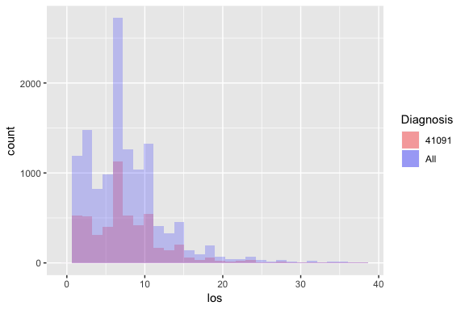
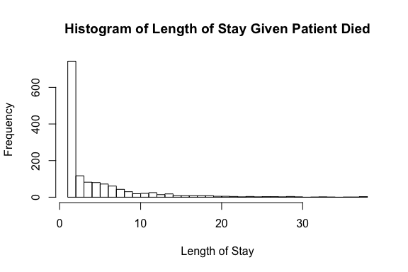
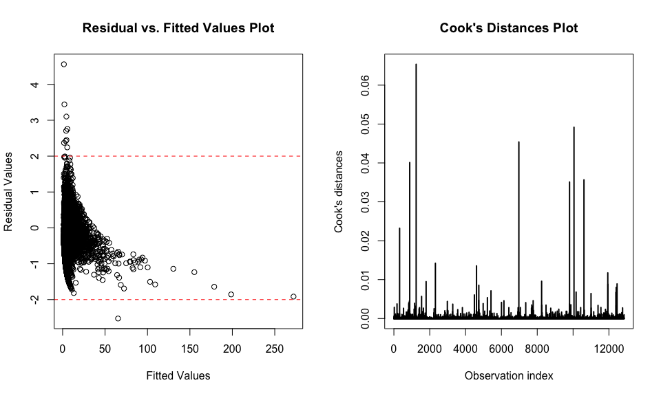

# Abstract

This R markdown file serves to fit a Guassian model to the response data. The motivation for this is because the response variable exhibits right-skewness. See the exploratory data analysis notebook for visuals in support of this claim.

# Fitting the Gamma GLM

### Discussion of zero-valued observation

Before we can fit the Gamma GLM, we need to deal with the one observation that has a response value of zero, as the Gamma distribution is defined for all positive continuous numbers. Note that our response variable is discrete, but time itself is a continuous metric, and we can think of the response variable as an aggregated form of a continuous latent variable. We first examined the details of the zero-valued observation to see if there was anything awry. 


```r
ami = readRDS("data/amidata_clean.rds")
ami[ami$los == 0, ]
```

```
##      patient diagnosis sex drg died charges los age charges.na
## 9159    9159     41091   F 122    0   10366   0  53          0
```

```r
table(ami$los)[1:15]
```

```
## 
##    0    1    2    3    4    5    6    7    8    9   10   11   12   13   14 
##    1 1194  732  750  826  980 1303 1418 1262 1040  742  581  407  330  254
```

From the information about the zero-valued datapoint, we do not see anything that is unbelievable or any feature that would insinuate this point is an outlier besides the length of stay. Without information on how the data were collected, we can't know apriori whether this datapoint was a result of data misentry, a violation of hospital policies, or a medical miracle. We can, however, compare the distribution of length of stay for patients with the same diagnosis with the overall population to see if perhaps there is a discrepancy between groups.


```r
# Examination of diagnosis
library(ggplot2)
ggplot(data=ami, aes(x=los)) +
    geom_histogram(data=subset(ami, diagnosis == 41091), aes(fill='41091'), alpha = 0.2) +
    geom_histogram(alpha = 0.2, aes(fill='All')) + 
    scale_fill_manual(name="Diagnosis", values=c('red', 'blue'))
```

<!-- -->

The results indicate that the diagnosis is representative of the overall population, and therefore the mixed effects hypothesis is not a valid reason for why we are seeing an outlier. This makes sense contextually since the diagnosis code 41091 represents "Acute myocardial infarction of unspecified site, initial episode of care - as a primary diagnosis." The "unspecified site" likely means it is a catchall diagnosis and spans a wide range of severity.

We can also look at the length of stay for the patients who died to see if there is a peak at 1 day. Our suspicion is that of the patients who died, a considerable number of them would have died the same day, as survival is extremely short-term when the heart stops beating. 


```r
hist(subset(ami$los, ami$died == 1), breaks=40, 
     xlab='Length of Stay', main='Histogram of Length of Stay Given Patient Died')
```

<!-- -->

We do see a considerable peak at 1 day. This observation is convincing, but Professor Glickman pointed out that if the length of stay is based around the completion of paperwork, it is possible that patients who die the same day do not have their paperwork completed until the next. 

Taking everything into consideration, we are left with a few options:

1. Remove the datapoint under the assumption that it was incorrectly entered, using the length of stay distribution for those who died as evidence that same-day discharge is equivalent to a length of stay of 1.

2. Remove the datapoint under the assumption that it was correctly entered, effectively imposing a floor on our data and reflecting that in the model inference.

3. Shift all the response values by +1 under the assumption that the datapoint is accurate, and there is one person who was discharged and/or had their paperwork completed on the same day. Adjust the model interpretation correspondingly.

4. Change the datapoint to be 1, under the assumption that the data was generated using some kind of rounding to the nearest day, and to coincide with what we would likely do with our Gamma model's predictions that fall below 0.5. 

We also considered the option of fitting a hurdle model to the data, where the zero population would come from a binomial distribution and the rest of the data would come from a Gamma distribution. However, we determined it was not meaningful to fit a model parameter to a single datapoint, thereby electing to forgo this approach.

Ultimately, we chose to round the zero-valued datapoint to 1. This decision was motivated in large part by the mechanics of what would happen to a Gamma model prediction that was close to 0 (we would end up rounding this value to the nearest positive integer anyway), and also from the fact that removing a single, non-influential (none of the feature values were extreme) datatpoint from a dataset of more than 12,000 patients will have little to no effect on the predictions of our model. 


```r
ami$los[ami$los == 0] = 1
```

### Feature Selection

We chose our best fit model using stepwise feature selection. The stepwise regression uses an iterative forward/backward selection method and the AIC criterion to choose the best model. To get a baseline, we first ran stepwise feature selection without interaction terms.


```r
# Without interaction terms
step(glm(los ~ ., family=Gamma(log), data=ami), trace=0, direction='both')
```

```
## 
## Call:  glm(formula = los ~ patient + diagnosis + sex + drg + charges + 
##     age + charges.na, family = Gamma(log), data = ami)
## 
## Coefficients:
##    (Intercept)         patient  diagnosis41011  diagnosis41021  
##      8.815e-01      -2.781e-05      -7.186e-03      -3.223e-02  
## diagnosis41031  diagnosis41041  diagnosis41051  diagnosis41071  
##     -8.141e-02      -1.568e-02       9.056e-02       5.301e-03  
## diagnosis41081  diagnosis41091            sexM          drg122  
##     -7.347e-03       3.639e-02      -3.902e-02      -3.845e-02  
##         drg123         charges             age      charges.na  
##     -7.290e-01       7.486e-05       8.397e-03       1.644e-01  
## 
## Degrees of Freedom: 12843 Total (i.e. Null);  12828 Residual
## Null Deviance:	    6558 
## Residual Deviance: 3271 	AIC: 64890
```

The results indicate that the ```died``` feature did not improve the model fit to where it was warranted including it as an extra predictor. Next, we ran stepwise feature selection with all the interaction terms considered (of which there are many due to the multi-level factors in our dataset), to compare with our baseline.  


```r
# With interaction terms
step(glm(los ~ .^2, family=Gamma(log), data=ami), trace=0, direction='both')
```

```
## 
## Call:  glm(formula = los ~ patient + diagnosis + sex + drg + charges + 
##     age + charges.na + patient:diagnosis + patient:sex + patient:drg + 
##     patient:charges + patient:charges.na + diagnosis:drg + diagnosis:charges + 
##     sex:age + sex:charges.na + drg:charges + drg:age + drg:charges.na + 
##     charges:age, family = Gamma(log), data = ami)
## 
## Coefficients:
##            (Intercept)                 patient          diagnosis41011  
##              5.689e-01              -1.160e-05               1.941e-01  
##         diagnosis41021          diagnosis41031          diagnosis41041  
##              1.966e-01              -1.642e-01               3.261e-02  
##         diagnosis41051          diagnosis41071          diagnosis41081  
##              1.066e-01               1.212e-01              -1.781e-01  
##         diagnosis41091                    sexM                  drg122  
##              1.025e-01               1.377e-01              -1.273e-01  
##                 drg123                 charges                     age  
##             -9.040e-01               8.282e-05               1.306e-02  
##             charges.na  patient:diagnosis41011  patient:diagnosis41021  
##              8.901e-02              -4.933e-06              -1.536e-05  
## patient:diagnosis41031  patient:diagnosis41041  patient:diagnosis41051  
##              1.341e-06              -7.988e-06              -2.346e-05  
## patient:diagnosis41071  patient:diagnosis41081  patient:diagnosis41091  
##             -1.563e-05               1.491e-05              -7.914e-06  
##           patient:sexM          patient:drg122          patient:drg123  
##              4.447e-06              -6.550e-07              -1.309e-05  
##        patient:charges      patient:charges.na   diagnosis41011:drg122  
##             -1.063e-09               2.707e-05              -6.366e-02  
##  diagnosis41021:drg122   diagnosis41031:drg122   diagnosis41041:drg122  
##              2.456e-02               9.699e-02               4.488e-02  
##  diagnosis41051:drg122   diagnosis41071:drg122   diagnosis41081:drg122  
##              9.654e-02              -9.068e-03              -3.013e-02  
##  diagnosis41091:drg122   diagnosis41011:drg123   diagnosis41021:drg123  
##              3.017e-02              -5.678e-02              -3.118e-01  
##  diagnosis41031:drg123   diagnosis41041:drg123   diagnosis41051:drg123  
##             -8.174e-02               7.444e-02               3.150e-01  
##  diagnosis41071:drg123   diagnosis41081:drg123   diagnosis41091:drg123  
##              3.592e-02               1.240e-01               1.820e-02  
## diagnosis41011:charges  diagnosis41021:charges  diagnosis41031:charges  
##             -1.134e-05              -9.897e-06               3.827e-06  
## diagnosis41041:charges  diagnosis41051:charges  diagnosis41071:charges  
##             -1.202e-06               5.110e-06               1.961e-07  
## diagnosis41081:charges  diagnosis41091:charges                sexM:age  
##              4.002e-06              -1.871e-06              -2.989e-03  
##        sexM:charges.na          drg122:charges          drg123:charges  
##             -9.337e-02               2.007e-05               4.437e-05  
##             drg122:age              drg123:age       drg122:charges.na  
##             -1.826e-03              -2.588e-03              -1.674e-01  
##      drg123:charges.na             charges:age  
##             -5.817e-02              -1.659e-07  
## 
## Degrees of Freedom: 12843 Total (i.e. Null);  12782 Residual
## Null Deviance:	    6558 
## Residual Deviance: 3127 	AIC: 64390
```

As we can see from the step function output, the addition of a handful of interaction terms between ```patient```, ```diagnosis```, ```age```, ```charges```, ```drg```, and ```charges.na```. Next, we ran the model with these specified interaction to obtain the following fit.


```r
gamma_model = glm(formula = los ~ patient + diagnosis + sex + drg + charges + 
    age + charges.na + patient:diagnosis + patient:sex + patient:drg + 
    patient:charges + patient:charges.na + diagnosis:drg + diagnosis:charges + 
    sex:age + sex:charges.na + drg:charges + drg:age + drg:charges.na + 
    charges:age, family = Gamma(log), data = ami)
summary(gamma_model)
```

```
## 
## Call:
## glm(formula = los ~ patient + diagnosis + sex + drg + charges + 
##     age + charges.na + patient:diagnosis + patient:sex + patient:drg + 
##     patient:charges + patient:charges.na + diagnosis:drg + diagnosis:charges + 
##     sex:age + sex:charges.na + drg:charges + drg:age + drg:charges.na + 
##     charges:age, family = Gamma(log), data = ami)
## 
## Deviance Residuals: 
##     Min       1Q   Median       3Q      Max  
## -2.5276  -0.3568  -0.0283   0.2387   4.5603  
## 
## Coefficients:
##                          Estimate Std. Error t value Pr(>|t|)    
## (Intercept)             5.689e-01  9.503e-02   5.986 2.20e-09 ***
## patient                -1.160e-05  7.028e-06  -1.651  0.09872 .  
## diagnosis41011          1.941e-01  7.351e-02   2.641  0.00828 ** 
## diagnosis41021          1.966e-01  1.156e-01   1.701  0.08898 .  
## diagnosis41031         -1.642e-01  1.113e-01  -1.476  0.14004    
## diagnosis41041          3.261e-02  7.155e-02   0.456  0.64861    
## diagnosis41051          1.066e-01  1.329e-01   0.803  0.42225    
## diagnosis41071          1.212e-01  7.434e-02   1.630  0.10308    
## diagnosis41081         -1.781e-01  1.259e-01  -1.415  0.15712    
## diagnosis41091          1.025e-01  6.873e-02   1.492  0.13573    
## sexM                    1.377e-01  5.111e-02   2.694  0.00707 ** 
## drg122                 -1.273e-01  7.382e-02  -1.724  0.08464 .  
## drg123                 -9.040e-01  1.157e-01  -7.816 5.88e-15 ***
## charges                 8.282e-05  5.287e-06  15.664  < 2e-16 ***
## age                     1.306e-02  9.277e-04  14.082  < 2e-16 ***
## charges.na              8.901e-02  5.104e-02   1.744  0.08121 .  
## patient:diagnosis41011 -4.933e-06  7.041e-06  -0.701  0.48358    
## patient:diagnosis41021 -1.536e-05  1.110e-05  -1.383  0.16659    
## patient:diagnosis41031  1.341e-06  1.062e-05   0.126  0.89949    
## patient:diagnosis41041 -7.988e-06  6.800e-06  -1.175  0.24013    
## patient:diagnosis41051 -2.346e-05  1.309e-05  -1.792  0.07323 .  
## patient:diagnosis41071 -1.563e-05  7.220e-06  -2.165  0.03044 *  
## patient:diagnosis41081  1.491e-05  1.203e-05   1.239  0.21542    
## patient:diagnosis41091 -7.914e-06  6.518e-06  -1.214  0.22472    
## patient:sexM            4.447e-06  2.430e-06   1.830  0.06721 .  
## patient:drg122         -6.550e-07  2.657e-06  -0.247  0.80527    
## patient:drg123         -1.309e-05  4.105e-06  -3.190  0.00143 ** 
## patient:charges        -1.063e-09  2.076e-10  -5.123 3.05e-07 ***
## patient:charges.na      2.707e-05  5.321e-06   5.087 3.70e-07 ***
## diagnosis41011:drg122  -6.366e-02  5.763e-02  -1.105  0.26937    
## diagnosis41021:drg122   2.456e-02  8.640e-02   0.284  0.77625    
## diagnosis41031:drg122   9.699e-02  8.319e-02   1.166  0.24368    
## diagnosis41041:drg122   4.488e-02  5.566e-02   0.806  0.42002    
## diagnosis41051:drg122   9.654e-02  1.021e-01   0.945  0.34463    
## diagnosis41071:drg122  -9.068e-03  5.775e-02  -0.157  0.87524    
## diagnosis41081:drg122  -3.013e-02  8.398e-02  -0.359  0.71974    
## diagnosis41091:drg122   3.017e-02  5.385e-02   0.560  0.57530    
## diagnosis41011:drg123  -5.678e-02  7.438e-02  -0.763  0.44529    
## diagnosis41021:drg123  -3.118e-01  1.209e-01  -2.579  0.00992 ** 
## diagnosis41031:drg123  -8.174e-02  1.260e-01  -0.649  0.51662    
## diagnosis41041:drg123   7.444e-02  7.521e-02   0.990  0.32225    
## diagnosis41051:drg123   3.150e-01  1.350e-01   2.334  0.01959 *  
## diagnosis41071:drg123   3.592e-02  8.511e-02   0.422  0.67301    
## diagnosis41081:drg123   1.240e-01  1.094e-01   1.133  0.25715    
## diagnosis41091:drg123   1.820e-02  6.893e-02   0.264  0.79177    
## diagnosis41011:charges -1.134e-05  3.796e-06  -2.987  0.00282 ** 
## diagnosis41021:charges -9.897e-06  5.768e-06  -1.716  0.08621 .  
## diagnosis41031:charges  3.827e-06  6.433e-06   0.595  0.55197    
## diagnosis41041:charges -1.202e-06  3.781e-06  -0.318  0.75053    
## diagnosis41051:charges  5.110e-06  8.850e-06   0.577  0.56365    
## diagnosis41071:charges  1.961e-07  3.889e-06   0.050  0.95978    
## diagnosis41081:charges  4.002e-06  5.659e-06   0.707  0.47951    
## diagnosis41091:charges -1.871e-06  3.586e-06  -0.522  0.60172    
## sexM:age               -2.989e-03  7.024e-04  -4.255 2.10e-05 ***
## sexM:charges.na        -9.337e-02  3.957e-02  -2.360  0.01831 *  
## drg122:charges          2.007e-05  1.684e-06  11.923  < 2e-16 ***
## drg123:charges          4.437e-05  2.015e-06  22.013  < 2e-16 ***
## drg122:age             -1.826e-03  7.310e-04  -2.498  0.01249 *  
## drg123:age             -2.588e-03  1.285e-03  -2.014  0.04403 *  
## drg122:charges.na      -1.674e-01  4.110e-02  -4.072 4.68e-05 ***
## drg123:charges.na      -5.817e-02  6.560e-02  -0.887  0.37523    
## charges:age            -1.659e-07  5.548e-08  -2.989  0.00280 ** 
## ---
## Signif. codes:  0 '***' 0.001 '**' 0.01 '*' 0.05 '.' 0.1 ' ' 1
## 
## (Dispersion parameter for Gamma family taken to be 0.2409046)
## 
##     Null deviance: 6557.8  on 12843  degrees of freedom
## Residual deviance: 3127.4  on 12782  degrees of freedom
## AIC: 64387
## 
## Number of Fisher Scoring iterations: 8
```

As diagnostics to evaluate the fit of our model, we produced a plot of residual deviance and Cook's distances.


```r
par(mfrow=c(1,2))
# Residuals plot
plot(residuals(gamma_model)~fitted(gamma_model),
     xlab="Fitted Values",
     ylab="Residual Values", 
     main="Residual vs. Fitted Values Plot")
abline(h = -2, lty = 2, col = 'red')
abline(h = 2, lty = 2, col = 'red')
# Cook's distance plot
plot(cooks.distance(gamma_model), type="h", lwd=2,
  xlab="Observation index",
  ylab="Cook's distances",
  main="Cook's Distances Plot")
abline(h=1,lty=2,col="red")
```

<!-- -->


The residuals plot indicates there are a handful of outliers that breach the +/- 2 threshold, but the Cook's distance plot shows there are no influential points of note. 

Finally, we examined the potential for collinearity using the Variance Inflation Factor (VIF).


```r
library(car)
vif(gamma_model)
```

```
##                            GVIF Df GVIF^(1/(2*Df))
## patient            3.620404e+01  1        6.016979
## diagnosis          4.203666e+07  8        2.995551
## sex                3.326799e+01  1        5.767841
## drg                3.955274e+03  2        7.930382
## charges            6.061380e+01  1        7.785486
## age                8.553559e+00  1        2.924647
## charges.na         7.147631e+00  1        2.673505
## patient:diagnosis  2.606018e+06  8        2.517669
## patient:sex        5.701344e+00  1        2.387749
## patient:drg        2.567210e+01  2        2.250947
## patient:charges    1.046766e+01  1        3.235377
## patient:charges.na 4.387222e+00  1        2.094570
## diagnosis:drg      7.783857e+05 16        1.527917
## diagnosis:charges  3.880752e+05  8        2.235153
## sex:age            2.778057e+01  1        5.270727
## sex:charges.na     2.622475e+00  1        1.619406
## drg:charges        1.235286e+01  2        1.874744
## drg:age            1.225686e+03  2        5.916908
## drg:charges.na     2.489633e+00  2        1.256128
## charges:age        3.600017e+01  1        6.000014
```

There are a number of terms with a GVIF^(1/(2*Df)) greater than $\sqrt{10}$, though we suspect this is due to the presence of interaction terms. We therefore fit the baseline model without interaction terms and redid the VIF inspection.


```r
baseline_model = glm(formula = los ~ patient + diagnosis + sex + drg + charges + 
    age + charges.na, family = Gamma(log), data = ami)
vif(baseline_model)
```

```
##                GVIF Df GVIF^(1/(2*Df))
## patient    1.060016  1        1.029571
## diagnosis  1.054565  8        1.003326
## sex        1.103374  1        1.050416
## drg        1.198773  2        1.046368
## charges    1.108682  1        1.052940
## age        1.223877  1        1.106290
## charges.na 1.001325  1        1.000662
```

These values are all much less than $\sqrt{10}$, suggesting there is no multicollinearity in the base predictors, and the multicollinearity present in the full model comes from the interaction terms.


