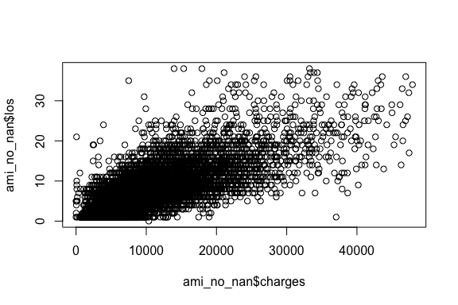
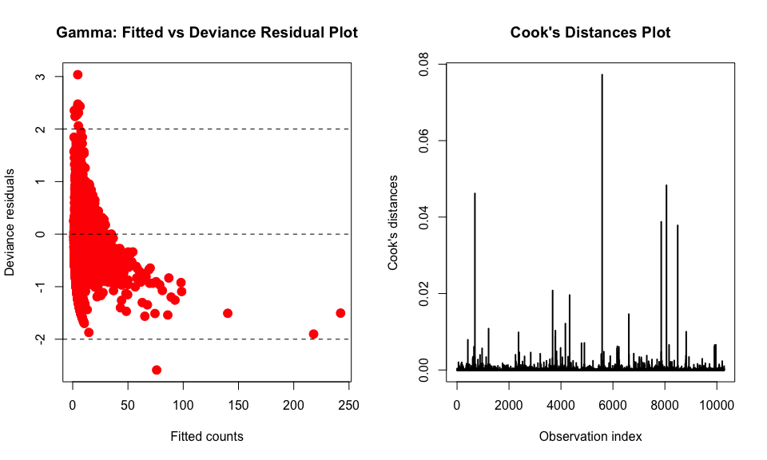
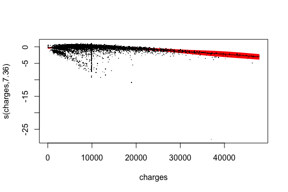
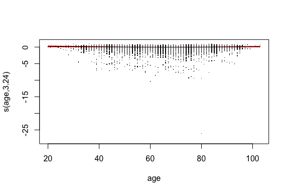
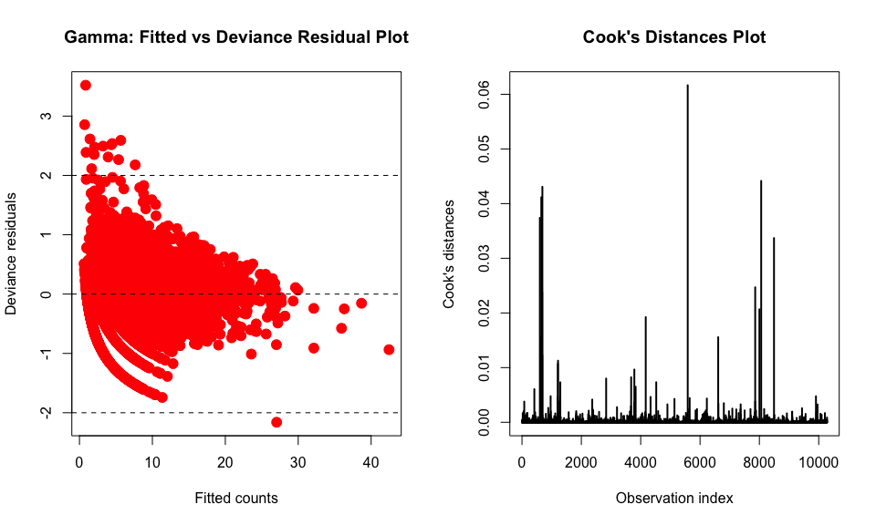

# Abstract

This R markdown file serves to fit a Gamma model to the response data. The motivation for this is because the response variable exhibits right-skewness. See the exploratory data analysis notebook for visuals in support of this claim.


```r
library(mgcv)
library(tidymodels)
library(ggplot2)
library(car)
```


# Pre-Processing
- mean-imputed on charges and added charges.na
- Drop `Patient` ID column because of irrelevance
- Drop `DIED` column because of perfect colinearity with `DRG` (`DRG` == 123 when `DIED` == 1) 


```r
ami_init = readRDS("../../data/amidata_clean.rds")
drops <- c("patient","died")
ami = ami_init[ , !(names(ami_init) %in% drops)]
```

## Cross-validation
- We split the data with 80% in training set and 20% on a held-out test set for model evaluation. We set the random seed at 42 to ensure consistency across models.


```r
# Split data
set.seed(42)
ami_split <- initial_split(ami, prop = .8, strata = "los") # Stratified sampling based on LOS
ami_train <- training(ami_split)
ami_test  <- testing(ami_split)
```


# Fitting the Gamma GLM

### Discussion of zero-valued observation

Before we can fit the Gamma GLM, we need to deal with the one observation that has a response value of zero, as the Gamma distribution is defined for all positive continuous numbers. Note that our response variable is discrete, but time itself is a continuous metric, and we can think of the response variable as an aggregated form of a continuous latent variable. We first examined the details of the zero-valued observation to see if there was anything awry. 


```r
ami[ami$los == 0, ]
```

```
##      diagnosis sex drg charges los age charges.na
## 9159     41091   F 122   10366   0  53          0
```

```r
table(ami$los)[1:15]
```

```
## 
##    0    1    2    3    4    5    6    7    8    9   10   11   12   13   14 
##    1 1194  732  750  826  980 1303 1418 1262 1040  742  581  407  330  254
```

From the information about the zero-valued datapoint, we do not see anything that is unbelievable or any feature that would insinuate this point is an outlier besides the length of stay. Without information on how the data were collected, we can't know apriori whether this datapoint was a result of data misentry, a violation of hospital policies, or a medical miracle. We can, however, compare the distribution of length of stay for patients with the same diagnosis with the overall population to see if perhaps there is a discrepancy between groups.


```r
# Examination of diagnosis
ggplot(data=ami, aes(x=los)) +
    geom_histogram(data=subset(ami, diagnosis == 41091), aes(fill='41091'), alpha = 0.2) +
    geom_histogram(alpha = 0.2, aes(fill='All')) + 
    scale_fill_manual(name="Diagnosis", values=c('red', 'blue'))
```

<!-- -->

The results indicate that the diagnosis is representative of the overall population, and therefore the mixed effects hypothesis is not a valid reason for why we are seeing an outlier. This makes sense contextually since the diagnosis code 41091 represents "Acute myocardial infarction of unspecified site, initial episode of care - as a primary diagnosis." The "unspecified site" likely means it is a catchall diagnosis and spans a wide range of severity.

We can also look at the length of stay for the patients who died to see if there is a peak at 1 day. Our suspicion is that of the patients who died, a considerable number of them would have died the same day, as survival is extremely short-term when the heart stops beating. 


```r
hist(subset(ami_init$los, ami_init$died == 1), breaks=40, 
     xlab='Length of Stay', main='Histogram of Length of Stay Given Patient Died')
```

<!-- -->

We do see a considerable peak at 1 day. This observation is convincing, but Professor Glickman pointed out that if the length of stay is based around the completion of paperwork, it is possible that patients who die the same day do not have their paperwork completed until the next. 

Taking everything into consideration, we are left with a few options:

1. Remove the datapoint under the assumption that it was incorrectly entered, using the length of stay distribution for those who died as evidence that same-day discharge is equivalent to a length of stay of 1.

2. Remove the datapoint under the assumption that it was correctly entered, effectively imposing a floor on our data and reflecting that in the model inference.

3. Shift all the response values by +1 under the assumption that the datapoint is accurate, and there is one person who was discharged and/or had their paperwork completed on the same day. Adjust the model interpretation correspondingly.

4. Change the datapoint to be 1, under the assumption that the data was generated using some kind of rounding to the nearest day, and to coincide with what we would likely do with our Gamma model's predictions that fall below 0.5. 

We also considered the option of fitting a hurdle model to the data, where the zero population would come from a binomial distribution and the rest of the data would come from a Gamma distribution. However, we determined it was not meaningful to fit a model parameter to a single datapoint, thereby electing to forgo this approach.

Ultimately, we chose to round the zero-valued datapoint to 1. This decision was motivated in large part by the mechanics of what would happen to a Gamma model prediction that was close to 0 (we would end up rounding this value to the nearest positive integer anyway), and also from the fact that removing a single, non-influential (none of the feature values were extreme) datatpoint from a dataset of more than 12,000 patients will have little to no effect on the predictions of our model. 


```r
ami_train$los[ami_train$los == 0] = 1
ami_test$los[ami_test$los == 0] = 1
```

### Feature Selection

We chose our best fit model using stepwise feature selection. The stepwise regression uses an iterative forward/backward selection method and the AIC criterion to choose the best model. To get a baseline, we first ran stepwise feature selection without interaction terms. Note, we removed patient id since there should be no causal connection between the patient id and the length of stay if the data were appropriately randomized.


```r
# Without interaction terms
step_noint = stats::step(glm(los ~ ., family=Gamma(log), data=ami_train), trace=0, direction='both')
# With interaction terms
step_int = stats::step(glm(los ~ .^2, family=Gamma(log), data=ami_train), trace=0, direction='both')

# Save model
save(step_noint, file = 'step_noint.rds')
save(step_int, file = "step_int.rds")
```

Next, we ran stepwise feature selection with all the interaction terms considered (of which there are many due to the multi-level factors in our dataset), to compare with our baseline.  


We then examined the summaries of both models.


```r
# No interaction model
gamma_noint = glm(formula = formula(step_noint), family = Gamma(log), data = ami_train)
summary(gamma_noint)
```

```
## 
## Call:
## glm(formula = formula(step_noint), family = Gamma(log), data = ami_train)
## 
## Deviance Residuals: 
##      Min        1Q    Median        3Q       Max  
## -2.17801  -0.37889  -0.03348   0.24013   3.01268  
## 
## Coefficients:
##                  Estimate Std. Error t value Pr(>|t|)    
## (Intercept)     7.071e-01  4.050e-02  17.462  < 2e-16 ***
## diagnosis41011  2.787e-02  2.893e-02   0.963  0.33532    
## diagnosis41021  3.859e-02  4.403e-02   0.877  0.38076    
## diagnosis41031 -6.757e-02  4.220e-02  -1.601  0.10943    
## diagnosis41041  1.544e-02  2.797e-02   0.552  0.58107    
## diagnosis41051  9.331e-02  5.296e-02   1.762  0.07809 .  
## diagnosis41071  3.414e-02  2.929e-02   1.166  0.24380    
## diagnosis41081 -2.970e-02  4.215e-02  -0.705  0.48102    
## diagnosis41091  7.716e-02  2.693e-02   2.866  0.00417 ** 
## sexM           -4.167e-02  1.069e-02  -3.898 9.76e-05 ***
## drg122         -4.491e-02  1.105e-02  -4.063 4.88e-05 ***
## drg123         -7.318e-01  1.743e-02 -41.976  < 2e-16 ***
## charges         7.146e-05  8.104e-07  88.176  < 2e-16 ***
## age             8.482e-03  4.043e-04  20.977  < 2e-16 ***
## charges.na      1.485e-01  2.159e-02   6.878 6.41e-12 ***
## ---
## Signif. codes:  0 '***' 0.001 '**' 0.01 '*' 0.05 '.' 0.1 ' ' 1
## 
## (Dispersion parameter for Gamma family taken to be 0.2524747)
## 
##     Null deviance: 5225.0  on 10278  degrees of freedom
## Residual deviance: 2709.5  on 10264  degrees of freedom
## AIC: 52319
## 
## Number of Fisher Scoring iterations: 7
```


```r
# Interaction model
gamma_int = glm(formula = formula(step_int), family = Gamma(log), data = ami_train)
summary(gamma_int)
```

```
## 
## Call:
## glm(formula = formula(step_int), family = Gamma(log), data = ami_train)
## 
## Deviance Residuals: 
##      Min        1Q    Median        3Q       Max  
## -2.58589  -0.36898  -0.03188   0.23238   3.03496  
## 
## Coefficients:
##                          Estimate Std. Error t value Pr(>|t|)    
## (Intercept)             4.026e-01  9.537e-02   4.222 2.44e-05 ***
## diagnosis41011          2.002e-01  6.876e-02   2.912 0.003597 ** 
## diagnosis41021          1.894e-01  1.066e-01   1.776 0.075709 .  
## diagnosis41031         -1.318e-01  1.072e-01  -1.229 0.218962    
## diagnosis41041          1.285e-02  6.712e-02   0.191 0.848223    
## diagnosis41051          1.082e-01  1.278e-01   0.847 0.397158    
## diagnosis41071          8.840e-02  6.875e-02   1.286 0.198526    
## diagnosis41081         -3.681e-02  1.017e-01  -0.362 0.717334    
## diagnosis41091          1.001e-01  6.406e-02   1.562 0.118222    
## sexM                    1.291e-01  5.448e-02   2.370 0.017796 *  
## drg122                 -9.634e-02  7.938e-02  -1.214 0.224924    
## drg123                 -1.064e+00  1.269e-01  -8.382  < 2e-16 ***
## charges                 8.352e-05  5.642e-06  14.802  < 2e-16 ***
## age                     1.465e-02  1.051e-03  13.945  < 2e-16 ***
## charges.na              1.990e-01  3.111e-02   6.398 1.65e-10 ***
## diagnosis41011:drg122  -8.361e-02  6.323e-02  -1.322 0.186083    
## diagnosis41021:drg122   2.296e-02  9.598e-02   0.239 0.810986    
## diagnosis41031:drg122   6.948e-02  9.181e-02   0.757 0.449212    
## diagnosis41041:drg122   3.855e-02  6.088e-02   0.633 0.526678    
## diagnosis41051:drg122   4.679e-02  1.146e-01   0.408 0.682999    
## diagnosis41071:drg122  -2.026e-02  6.333e-02  -0.320 0.749040    
## diagnosis41081:drg122  -1.026e-02  9.304e-02  -0.110 0.912188    
## diagnosis41091:drg122   3.515e-02  5.895e-02   0.596 0.551025    
## diagnosis41011:drg123  -9.761e-02  8.369e-02  -1.166 0.243500    
## diagnosis41021:drg123  -2.895e-01  1.319e-01  -2.196 0.028132 *  
## diagnosis41031:drg123  -2.139e-01  1.379e-01  -1.551 0.120943    
## diagnosis41041:drg123   6.915e-02  8.406e-02   0.823 0.410691    
## diagnosis41051:drg123   1.285e-01  1.496e-01   0.859 0.390355    
## diagnosis41071:drg123   8.340e-03  9.506e-02   0.088 0.930087    
## diagnosis41081:drg123   1.297e-01  1.219e-01   1.064 0.287211    
## diagnosis41091:drg123  -1.832e-02  7.724e-02  -0.237 0.812563    
## diagnosis41011:charges -1.140e-05  4.187e-06  -2.723 0.006490 ** 
## diagnosis41021:charges -1.335e-05  6.641e-06  -2.010 0.044414 *  
## diagnosis41031:charges  4.537e-06  6.984e-06   0.650 0.515902    
## diagnosis41041:charges -1.641e-06  4.157e-06  -0.395 0.693022    
## diagnosis41051:charges -6.648e-06  9.388e-06  -0.708 0.478837    
## diagnosis41071:charges -4.645e-06  4.257e-06  -1.091 0.275265    
## diagnosis41081:charges -6.092e-07  6.164e-06  -0.099 0.921280    
## diagnosis41091:charges -3.337e-06  3.940e-06  -0.847 0.397060    
## sexM:age               -2.560e-03  7.827e-04  -3.271 0.001077 ** 
## drg122:charges          1.840e-05  1.847e-06   9.962  < 2e-16 ***
## drg123:charges          5.443e-05  2.281e-06  23.863  < 2e-16 ***
## drg122:age             -2.215e-03  8.165e-04  -2.713 0.006679 ** 
## drg123:age             -2.512e-03  1.439e-03  -1.746 0.080874 .  
## drg122:charges.na      -1.580e-01  4.440e-02  -3.559 0.000374 ***
## drg123:charges.na      -4.387e-02  7.162e-02  -0.613 0.540187    
## charges:age            -3.281e-07  6.368e-08  -5.153 2.62e-07 ***
## ---
## Signif. codes:  0 '***' 0.001 '**' 0.01 '*' 0.05 '.' 0.1 ' ' 1
## 
## (Dispersion parameter for Gamma family taken to be 0.2375455)
## 
##     Null deviance: 5225.0  on 10278  degrees of freedom
## Residual deviance: 2585.2  on 10232  degrees of freedom
## AIC: 51880
## 
## Number of Fisher Scoring iterations: 8
```

In both model summaries, ```charges``` and ```charges.na``` appear to be significant predictors. Therefore we decided to keep the imputation as a part of the model. 

We carried out a likelihood ratio test to see whether the model with interaction terms results in a significantly better fit.


```r
anova(gamma_noint, gamma_int, test='Chisq')
```

```
## Analysis of Deviance Table
## 
## Model 1: los ~ diagnosis + sex + drg + charges + age + charges.na
## Model 2: los ~ diagnosis + sex + drg + charges + age + charges.na + diagnosis:drg + 
##     diagnosis:charges + sex:age + drg:charges + drg:age + drg:charges.na + 
##     charges:age
##   Resid. Df Resid. Dev Df Deviance  Pr(>Chi)    
## 1     10264     2709.5                          
## 2     10232     2585.2 32   124.28 < 2.2e-16 ***
## ---
## Signif. codes:  0 '***' 0.001 '**' 0.01 '*' 0.05 '.' 0.1 ' ' 1
```

The likelihood ratio test indicates that the model with interaction terms has significantly less residual deviance than the model without, therefore we chose to continue our analysis with the interaction model.

As diagnostics to evaluate the fit of our model, we produced a plot of residual deviance and Cook's distances.


```r
par(mfrow=c(1,2))
# Residuals plot
gamma.fitted = fitted(gamma_int)
gamma.devresid = residuals(gamma_int, type="deviance")
plot(gamma.fitted, gamma.devresid, xlab="Fitted counts", ylab="Deviance residuals", pch=19, col="red", cex=1.5, main="Gamma: Fitted vs Deviance Residual Plot")
abline(h=0,lty=2,col="black")
abline(h=2,lty=2,col="black")
abline(h=-2,lty=2,col="black")

# Cook's distance plot
plot(cooks.distance(gamma_int), type="h", lwd=2,
  xlab="Observation index",
  ylab="Cook's distances",
  main="Cook's Distances Plot")
abline(h=1,lty=2,col="red")
```

<!-- -->


We expect the deviance residuals to approximately follow a standard normal distribution. The residuals plot indicates that the spread of the residuals does stay within the +/- 2 threshold, but they are not symmetrically scattered. In particular, it seems like the Gamma model severely overestimates the length of stay for larger points, predicting values as high as 200 days when the maximum observed value is 38 days. The Cook's distance plot shows there are no influential points of note. 

Finally, we examined the potential for collinearity using the Variance Inflation Factor (VIF).


```r
vif(gamma_int)
```

```
##                           GVIF Df GVIF^(1/(2*Df))
## diagnosis         2.321969e+06  8        2.499574
## sex               3.055512e+01  1        5.527668
## drg               3.562044e+03  2        7.725469
## charges           5.473196e+01  1        7.398105
## age               8.875740e+00  1        2.979218
## charges.na        2.211670e+00  1        1.487168
## diagnosis:drg     6.893098e+05 16        1.522125
## diagnosis:charges 2.912638e+05  8        2.195421
## sex:age           2.786543e+01  1        5.278772
## drg:charges       1.196866e+01  2        1.859993
## drg:age           1.239812e+03  2        5.933883
## drg:charges.na    2.414415e+00  2        1.246531
## charges:age       3.792122e+01  1        6.158021
```

There are a number of terms with a GVIF^(1/(2*Df)) greater than $\sqrt{10}$, though we suspect this is due to the presence of interaction terms. We therefore fit the baseline model without interaction terms and redid the VIF inspection.


```r
baseline_model = glm(formula = los ~ diagnosis + sex + drg + charges + 
    age + charges.na, family = Gamma(log), data = ami_train)
vif(baseline_model)
```

```
##                GVIF Df GVIF^(1/(2*Df))
## diagnosis  1.042420  8        1.002600
## sex        1.107249  1        1.052259
## drg        1.205879  2        1.047915
## charges    1.062377  1        1.030717
## age        1.236616  1        1.112032
## charges.na 1.001785  1        1.000892
```

These values are all much less than $\sqrt{10}$, suggesting there is no multicollinearity in the base predictors, and the multicollinearity present in the full model comes from the interaction terms.

# GAM Model

We also explored using a Generalized Additive Model where we explore the application of nonlinear smooths to our GLM predictors. We can write out our linear predictor as following.

$g(\mu_i) = \beta_0 + S_1(x_{i1}) + ... +S_j(x_{ij})$

Individual $S_j$ functions refer to smooths applied to predictors.


```r
# GAM
gamma_gam = gam(formula = los ~ diagnosis + sex + drg + s(charges) + s(age)
                + charges.na + diagnosis:drg + diagnosis:charges + sex:age
                + drg:charges + drg:age + drg:charges.na + charges:age, data = ami_train, family = Gamma(log))

save(gamma_gam, file='gamma_gam.rds')
```


```r
load('gamma_gam.rds')
summary(gamma_gam)
```

```
## 
## Family: Gamma 
## Link function: log 
## 
## Formula:
## los ~ diagnosis + sex + drg + s(charges) + s(age) + charges.na + 
##     diagnosis:drg + diagnosis:charges + sex:age + drg:charges + 
##     drg:age + drg:charges.na + charges:age
## 
## Parametric coefficients:
##                          Estimate Std. Error t value Pr(>|t|)    
## (Intercept)             0.000e+00  0.000e+00      NA       NA    
## diagnosis41011          1.974e-01  6.834e-02   2.889 0.003875 ** 
## diagnosis41021          5.973e-02  1.059e-01   0.564 0.572834    
## diagnosis41031         -1.065e-01  1.065e-01  -0.999 0.317649    
## diagnosis41041          4.997e-02  6.672e-02   0.749 0.453863    
## diagnosis41051          1.540e-01  1.270e-01   1.212 0.225431    
## diagnosis41071          1.318e-01  6.837e-02   1.928 0.053842 .  
## diagnosis41081         -5.763e-03  1.010e-01  -0.057 0.954501    
## diagnosis41091          1.696e-01  6.371e-02   2.662 0.007789 ** 
## sexM                   -4.997e-02  5.599e-02  -0.892 0.372154    
## drg122                  1.038e-01  8.005e-02   1.297 0.194767    
## drg123                 -4.914e-01  1.275e-01  -3.855 0.000117 ***
## charges.na              8.932e-02  3.206e-02   2.786 0.005341 ** 
## diagnosis41011:drg122  -8.976e-02  6.281e-02  -1.429 0.152975    
## diagnosis41021:drg122   4.384e-02  9.534e-02   0.460 0.645626    
## diagnosis41031:drg122   8.035e-02  9.117e-02   0.881 0.378127    
## diagnosis41041:drg122   1.762e-02  6.049e-02   0.291 0.770794    
## diagnosis41051:drg122  -2.285e-02  1.138e-01  -0.201 0.840853    
## diagnosis41071:drg122  -3.912e-02  6.290e-02  -0.622 0.534043    
## diagnosis41081:drg122  -3.935e-02  9.238e-02  -0.426 0.670137    
## diagnosis41091:drg122   1.564e-03  5.857e-02   0.027 0.978705    
## diagnosis41011:drg123  -1.640e-01  8.312e-02  -1.973 0.048527 *  
## diagnosis41021:drg123  -2.241e-01  1.310e-01  -1.711 0.087139 .  
## diagnosis41031:drg123  -2.171e-01  1.370e-01  -1.586 0.112876    
## diagnosis41041:drg123  -2.025e-02  8.352e-02  -0.242 0.808464    
## diagnosis41051:drg123   1.778e-03  1.486e-01   0.012 0.990451    
## diagnosis41071:drg123  -1.110e-01  9.446e-02  -1.175 0.240020    
## diagnosis41081:drg123   9.287e-02  1.210e-01   0.767 0.442924    
## diagnosis41091:drg123  -6.509e-02  7.673e-02  -0.848 0.396324    
## diagnosis41001:charges  1.291e-04  1.466e-05   8.809  < 2e-16 ***
## diagnosis41011:charges  1.188e-04  1.436e-05   8.273  < 2e-16 ***
## diagnosis41021:charges  1.242e-04  1.523e-05   8.157 3.84e-16 ***
## diagnosis41031:charges  1.300e-04  1.554e-05   8.366  < 2e-16 ***
## diagnosis41041:charges  1.246e-04  1.434e-05   8.694  < 2e-16 ***
## diagnosis41051:charges  1.206e-04  1.675e-05   7.200 6.44e-13 ***
## diagnosis41071:charges  1.233e-04  1.438e-05   8.576  < 2e-16 ***
## diagnosis41081:charges  1.275e-04  1.505e-05   8.474  < 2e-16 ***
## diagnosis41091:charges  1.204e-04  1.438e-05   8.377  < 2e-16 ***
## sexF:age                1.111e-02  2.248e-03   4.940 7.95e-07 ***
## sexM:age                1.111e-02  2.392e-03   4.644 3.46e-06 ***
## drg122:charges         -4.807e-06  1.935e-06  -2.484 0.013007 *  
## drg123:charges          2.837e-05  2.328e-06  12.186  < 2e-16 ***
## drg122:age             -1.170e-03  8.327e-04  -1.405 0.159961    
## drg123:age             -3.909e-03  1.451e-03  -2.693 0.007090 ** 
## drg122:charges.na      -1.774e-01  4.409e-02  -4.024 5.77e-05 ***
## drg123:charges.na      -1.867e-01  7.128e-02  -2.619 0.008827 ** 
## charges:age            -1.274e-07  6.356e-08  -2.005 0.045013 *  
## ---
## Signif. codes:  0 '***' 0.001 '**' 0.01 '*' 0.05 '.' 0.1 ' ' 1
## 
## Approximate significance of smooth terms:
##              edf Ref.df      F  p-value    
## s(charges) 7.355  7.886 218.56  < 2e-16 ***
## s(age)     3.239  4.085  11.39 2.57e-09 ***
## ---
## Signif. codes:  0 '***' 0.001 '**' 0.01 '*' 0.05 '.' 0.1 ' ' 1
## 
## Rank: 63/65
## R-sq.(adj) =  0.573   Deviance explained = 57.7%
## GCV = 0.21719  Scale est. = 0.2341    n = 10279
```


We then perform a likelihood ratio between GLM and GAM to determine our final model for negative binomial model family. We needed to refit the GAM as a `glm` object, because of the limitation in `anova()` in R. We refitted the GAM using the same predictor and non-linear transformation suggested in the GAM model.


```r
# refit gam to fit into anova
ami_train <- ami_train %>% 
  mutate(
    charges_7 = (charges - mean(charges)) ^ 7,
    age_3 = (age - mean(age)) ^ 3
  )

# update formula to be glm
newvars <- c("charges_7", "age_3")
gam_glm_form <- attr(gamma_gam$terms, "term.labels") %>% 
  paste(., collapse = "+") %>% 
  paste(., paste(newvars, collapse ="+"), sep = "+") %>% 
  paste("los ~", .)

# Refit a glm with GAM variables
gamma_gam_glm <- glm(formula(gam_glm_form), data = ami_train, family=Gamma(log))
anova(gamma_int, gamma_gam_glm, test = "Chisq")
```

```
## Analysis of Deviance Table
## 
## Model 1: los ~ diagnosis + sex + drg + charges + age + charges.na + diagnosis:drg + 
##     diagnosis:charges + sex:age + drg:charges + drg:age + drg:charges.na + 
##     charges:age
## Model 2: los ~ diagnosis + sex + drg + charges.na + charges + age + diagnosis:drg + 
##     diagnosis:charges + sex:age + drg:charges + drg:age + drg:charges.na + 
##     charges:age + charges_7 + age_3
##   Resid. Df Resid. Dev Df Deviance  Pr(>Chi)    
## 1     10232     2585.2                          
## 2     10230     2556.2  2    29.05 < 2.2e-16 ***
## ---
## Signif. codes:  0 '***' 0.001 '**' 0.01 '*' 0.05 '.' 0.1 ' ' 1
```

The results of the likelihood ratio test indicate that the GAM model with interaction terms is significantly better than the GLM with interaction terms.


```r
plot(gamma_gam, residuals = TRUE, shade=TRUE, shade.col = 2)
```

<!-- --><!-- -->


```r
par(mfrow=c(1,2))
# Residuals plot
gamma.fitted = fitted(gamma_gam)
gamma.devresid = residuals(gamma_gam, type="deviance")
plot(gamma.fitted, gamma.devresid, xlab="Fitted counts", ylab="Deviance residuals", pch=19, col="red", cex=1.5, main="Gamma: Fitted vs Deviance Residual Plot")
abline(h=0,lty=2,col="black")
abline(h=2,lty=2,col="black")
abline(h=-2,lty=2,col="black")

# Cook's distance plot
plot(cooks.distance(gamma_gam), type="h", lwd=2,
  xlab="Observation index",
  ylab="Cook's distances",
  main="Cook's Distances Plot")
abline(h=1,lty=2,col="red")
```

<!-- -->

The fitted counts and the nonlinearity of the residuals improves a lot with the addition of the smooths!


```r
pred <- predict(gamma_gam, ami_test %>% dplyr::select(-los), type = "response")
rmse_vec(ami_test$los, pred)
```

```
## [1] 3.494172
```

