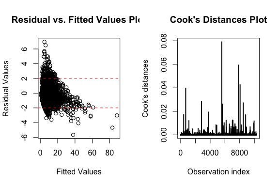

```{r setup}
knitr::opts_chunk$set(echo = TRUE)
library(faraway)
library(tidyverse)
library(tidymodels) # train test split
library(MASS)
library(car)
library(knitr)
```

# Data Preprocessing
- mean-imputed on charges and added charges.na
- Drop `Patient` ID column because of irrelevance
- Drop `DIED` column because of perfect colinearity with `DRG` (`DRG` == 123 when `DIED` == 1) 

# Cross-validation
- We split the data with 80% in training set and 20% on a held-out test set for model evaluation. We set the random seed at 42 to ensure consistency across models.

# Model 
- We consider negative binomial as one of the model choices, because our response variable `los` can be seen as number of trials. 
- We used stepwise regression to perform our feature selection. 
1. We start with two full models which includes all variables in the dataset, one included all variables as main effect (i.e., no interaction between variables) and one included all possible pairwise interaction between variables.

```{r load-data, include=FALSE}
# Read data
ami <- readRDS("../../data/amidata_clean.rds") %>%
  dplyr::select(-one_of(c("patient", "died")))
# Split data
set.seed(42)
ami_split <- initial_split(ami, prop = .8, strata = "los") # Stratified sampling based on LOS
ami_train <- training(ami_split)
ami_test  <- testing(ami_split)
```

```{r, eval=FALSE}
# Model fitting
step_noint <- stats::step(glm.nb(los ~ .,  data=ami_train), trace=0, direction='both')
step_withint <- stats::step(glm.nb(los ~ .^2., data=ami_train), trace=0, direction='both')

# Save model
# save(step_noint, file = 'step_noint.rds')
# save(step_withint, file = "step_withint.rds")
```

```{r load-model, include=FALSE}
# Load pre-trained model
load('step_noint.rds')
load('step_withint.rds')
```

2. We then fit two negative binomial models with the variables picked by the stepwise regression for no-interaction 
(`r as.character(formula(step_noint))[3]`) and with-interaction (`r as.character(formula(step_withint))[3]`)


```{r}
mod_nb_noint <- glm.nb(formula(step_noint), data = ami)
summary(mod_nb_noint)
```

```{r}
mod_nb_withint <- glm.nb(formula(step_withint), data = ami_train)
summary(mod_nb_withint)
```


Because both `charges` and `charges.na` are significant predictors in the model, we proceeded with the data with mean-imputed missing values. The ratio of residual deviance to residual degrees of freedom of both models are close to 1 which serve as a proxy of a good fit of the model to the data.

- Using likelihood ratio test, we conclude that the model with interaction terms is significantly different than the model without interaction terms. Therefore, we proceed with the model with interaction terms.

```{r, echo=FALSE}
anova(mod_nb_noint, mod_nb_withint)
```


## Model Diagnosis
We perform a couple model diagnosis to evaluate our model. 

### Residual plot and Cook's Distance
From the Cook's Distances plot, we observe no significant outlier because all observations are well below 1. From the residual vs fitted value plot, we can see some form of non-linear pattern, particularly, we see that the maximum fitted value is around 80, while the maximum of the true value `los` is only 38. 

```{r pressure, echo=FALSE, out.width = '100%'}

```

### Colinearity
We also looked at potential colinearity between our variables in the model. There are a number of terms with a GVIF^(1/(2*Df)) greater than $\sqrt{10}$ (3.16), though we suspect this is due to the presence of interaction terms. We therefore fit the baseline model without interaction terms and redid the VIF inspection.
```{r, echo=FALSE}
kable(car::vif(mod_nb_withint))
```


```{r}
model_noint_baseline = glm.nb(formula = los ~ diagnosis + sex + drg + charges + age + charges.na , data = ami_train)
kable(car::vif(model_noint_baseline))
```

These values are all much less than $\sqrt{10}$, suggesting there is no multicollinearity in the base predictors, and the multicollinearity present in the full model comes from the interaction terms.

## GAM
We also explored using GAM where we apply smoother terms to multiple predictors of our generalized linear model. We can write out our linear predictor as following.

$\mu_i = E(Y_i)$
$\eta_i = g(\mu_i) = \beta_0 + S_1(x_{i1}) + ... +S_j(x_{ij})$

Individual $S_j$ function refers to individual smoother functions applied to individual predictors.

```{r, include=FALSE}
library(mgcv)

add_spline <- function(var, k=NULL){
  if(is.null(k)){
    new_var_char <- paste0("s(", var, ")")
  } else{
    new_var_char <- paste0("s(", var, ", k = ", k, ")")
  }
  return(new_var_char)
}

# spline_vars <- c("charges", "age")
# form <- formula(mod_nb_withint)
# Function to update glm formula to gam
gam_update_form <- function(form, spline_vars){
  # Remove spline vars from main effect
  fterms <- terms(form)
  gam_spline_vars <- spline_vars %>%  # vars to add spline
    map_chr(add_spline) %>% # add spline
    paste(., collapse = "+") # concat them with "+"
  
  # Find index of vars to remove
  rm_spline_vars_inx <- spline_vars %>% 
    map_chr(., function(x) paste0("^", x, "$")) %>% # only remove main effect vars
    map_int(., function(x) grep(x, attr(mod_nb_withint$terms, "term.labels"))) 
  
  # Drop terms used in spline
  new_form <- drop.terms(fterms, dropx = rm_spline_vars_inx, keep.response = TRUE)
  # Add terms with spline
  new_form <- update(new_form, paste("~ . +", gam_spline_vars))
  return (new_form)
}
```

```{r, echo=FALSE}
spline_vars <- c("charges", "age")
gam_form <- gam_update_form(formula(mod_nb_withint), spline_vars) %>% formula()
neg_bin_gam <- gam(gam_form, family = nb(), data = ami_train)
```

We then perform a likelihood ratio between GLM and GAM to determine our final model for negative binomial model family. We needed to refit the GAM as a `glm` object, because of the limitation in `anova()` in R. We refitted the GAM using the same predictor and non-linear transformation suggested in the GAM model.
```{r, echo=FALSE}
# refit gam to fit into anova
ami_train <- ami_train %>% 
  mutate(
    charges_7 = (charges - mean(charges)) ^ 7,
    age_4 = (charges - mean(charges)) ^ 4
  )

# update formula to be glm
newvars <- c("charges_7", "age_4")
gam_glm_form <- attr(neg_bin_gam$terms, "term.labels") %>% 
  paste(., collapse = "+") %>% 
  paste(., paste(newvars, collapse ="+"), sep = "+") %>% 
  paste("los ~", .)

# Refit a glm with GAM variables
neg_bin_gam_glm <- glm.nb(formula(gam_glm_form), data = ami_train)
anova(mod_nb_withint, neg_bin_gam_glm, test = "Chi")
```

From the above result, we can see the GAM model (refitted in GLM) with smoothed variables (`charges_7` and `age_4`) is significantly better than the previous GLM model.

#### GAM Model Diagnosis
```{r gam-plot, echo=FALSE}
# plot(neg_bin_gam, residuals = TRUE, shade=TRUE, shade.col = 2)
# 
# knitr::include_graphics("negative-binomial_submit_files/figure-html/gam-plot-1.png")
# knitr::include_graphics("negative-binomial_submit_files/figure-html/gam-plot-2.png")
plot(neg_bin_gam, residuals = TRUE, shade=TRUE, shade.col = 2)
```

From the above chart, we can see the transformation of `charges` is nonlinear, particuarly, we see a piecewise linear relationship with a change at around 10000, where the transformation betcomes negative. 


# Test-set performance using final model - GAM
```{r, results=hide}
pred <- predict(neg_bin_gam, ami_test %>% dplyr::select(-los), type = "response")
rmse_vec(ami_test$los, pred)
```
We evaluate our test-set performance using RMSE and achieved a RMSE score of `r round(rmse_vec(ami_test$los, pred), 3)`