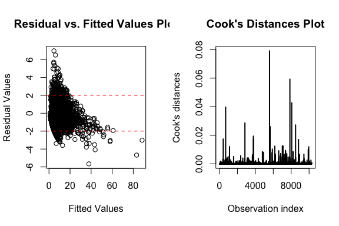
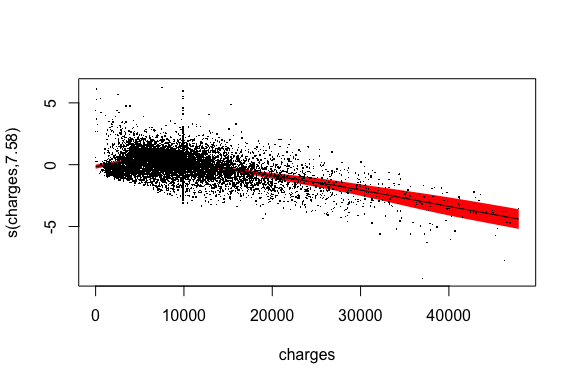
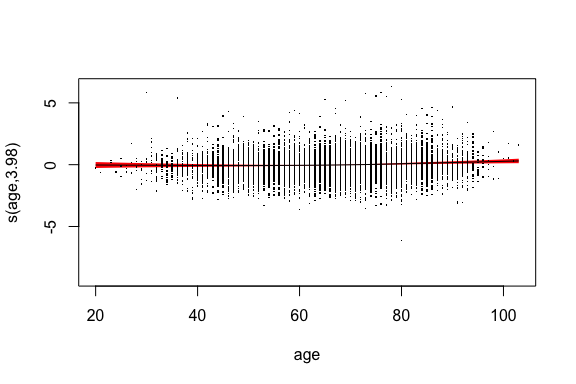

```r
knitr::opts_chunk$set(echo = TRUE)
library(faraway)
library(tidyverse)
```

```
## ── Attaching packages ───────────────────────────────────────── tidyverse 1.2.1 ──
```

```
## ✔ ggplot2 3.1.1       ✔ purrr   0.3.0  
## ✔ tibble  2.1.1       ✔ dplyr   0.8.0.1
## ✔ tidyr   0.8.2       ✔ stringr 1.4.0  
## ✔ readr   1.3.1       ✔ forcats 0.4.0
```

```
## Warning: package 'ggplot2' was built under R version 3.5.2
```

```
## Warning: package 'tibble' was built under R version 3.5.2
```

```
## Warning: package 'purrr' was built under R version 3.5.2
```

```
## Warning: package 'dplyr' was built under R version 3.5.2
```

```
## Warning: package 'stringr' was built under R version 3.5.2
```

```
## Warning: package 'forcats' was built under R version 3.5.2
```

```
## ── Conflicts ──────────────────────────────────────────── tidyverse_conflicts() ──
## ✖ dplyr::filter() masks stats::filter()
## ✖ dplyr::lag()    masks stats::lag()
```

```r
library(tidymodels) # train test split
```

```
## Warning: package 'tidymodels' was built under R version 3.5.2
```

```
## ── Attaching packages ──────────────────────────────────────── tidymodels 0.0.2 ──
```

```
## ✔ broom     0.5.1       ✔ recipes   0.1.5  
## ✔ dials     0.0.2       ✔ rsample   0.0.4  
## ✔ infer     0.4.0.1     ✔ yardstick 0.0.3  
## ✔ parsnip   0.0.2
```

```
## Warning: package 'infer' was built under R version 3.5.2
```

```
## Warning: package 'parsnip' was built under R version 3.5.2
```

```
## Warning: package 'recipes' was built under R version 3.5.2
```

```
## Warning: package 'rsample' was built under R version 3.5.2
```

```
## Warning: package 'yardstick' was built under R version 3.5.2
```

```
## ── Conflicts ─────────────────────────────────────────── tidymodels_conflicts() ──
## ✖ scales::discard() masks purrr::discard()
## ✖ dplyr::filter()   masks stats::filter()
## ✖ recipes::fixed()  masks stringr::fixed()
## ✖ dplyr::lag()      masks stats::lag()
## ✖ yardstick::spec() masks readr::spec()
## ✖ recipes::step()   masks stats::step()
```

```r
library(MASS)
```

```
## Warning: package 'MASS' was built under R version 3.5.2
```

```
## 
## Attaching package: 'MASS'
```

```
## The following object is masked from 'package:dplyr':
## 
##     select
```

```r
library(car)
```

```
## Loading required package: carData
```

```
## 
## Attaching package: 'car'
```

```
## The following object is masked from 'package:dplyr':
## 
##     recode
```

```
## The following object is masked from 'package:purrr':
## 
##     some
```

```
## The following objects are masked from 'package:faraway':
## 
##     logit, vif
```

```r
library(knitr)
```

# Data Preprocessing
- mean-imputed on charges and added charges.na
- Drop `Patient` ID column because of irrelevance
- Drop `DIED` column because of perfect colinearity with `DRG` (`DRG` == 123 when `DIED` == 1) 

# Cross-validation
- We split the data with 80% in training set and 20% on a held-out test set for model evaluation. We set the random seed at 42 to ensure consistency across models.

# Model 
- We consider negative binomial as one of the model choices, because our response variable `los` can be seen as number of trials. 
- We used stepwise regression to perform our feature selection. 
1. We start with two full models which includes all variables in the dataset, one included all variables as main effect (i.e., no interaction between variables) and one included all possible pairwise interaction between variables.


```r
# Model fitting
step_noint <- stats::step(glm.nb(los ~ .,  data=ami_train), trace=0, direction='both')
step_withint <- stats::step(glm.nb(los ~ .^2., data=ami_train), trace=0, direction='both')

# Save model
# save(step_noint, file = 'step_noint.rds')
# save(step_withint, file = "step_withint.rds")
```


2. We then fit two negative binomial models with the variables picked by the stepwise regression for no-interaction 
(diagnosis + sex + drg + charges + age + charges.na) and with-interaction (diagnosis + sex + drg + charges + age + charges.na + diagnosis:drg + diagnosis:charges + sex:age + drg:charges + drg:age + drg:charges.na + charges:age)


```r
mod_nb_noint <- glm.nb(formula(step_noint), data = ami)
summary(mod_nb_noint)
```

```
## 
## Call:
## glm.nb(formula = formula(step_noint), data = ami, init.theta = 14.58072939, 
##     link = log)
## 
## Deviance Residuals: 
##     Min       1Q   Median       3Q      Max  
## -4.4896  -0.7817  -0.0746   0.5047   6.8684  
## 
## Coefficients:
##                  Estimate Std. Error z value Pr(>|z|)    
## (Intercept)     8.821e-01  3.349e-02  26.337  < 2e-16 ***
## diagnosis41011 -7.332e-03  2.378e-02  -0.308   0.7578    
## diagnosis41021 -7.973e-03  3.602e-02  -0.221   0.8248    
## diagnosis41031 -6.750e-02  3.549e-02  -1.902   0.0572 .  
## diagnosis41041 -1.325e-02  2.308e-02  -0.574   0.5658    
## diagnosis41051  6.799e-02  4.293e-02   1.584   0.1132    
## diagnosis41071 -1.300e-02  2.401e-02  -0.541   0.5884    
## diagnosis41081 -5.895e-02  3.513e-02  -1.678   0.0933 .  
## diagnosis41091  3.756e-02  2.218e-02   1.693   0.0904 .  
## sexM           -4.548e-02  8.634e-03  -5.267 1.38e-07 ***
## drg122         -5.740e-02  8.876e-03  -6.467 9.97e-11 ***
## drg123         -6.529e-01  1.622e-02 -40.253  < 2e-16 ***
## charges         5.853e-05  5.578e-07 104.943  < 2e-16 ***
## age             8.578e-03  3.324e-04  25.807  < 2e-16 ***
## charges.na      1.372e-01  1.726e-02   7.948 1.89e-15 ***
## ---
## Signif. codes:  0 '***' 0.001 '**' 0.01 '*' 0.05 '.' 0.1 ' ' 1
## 
## (Dispersion parameter for Negative Binomial(14.5807) family taken to be 1)
## 
##     Null deviance: 27076  on 12843  degrees of freedom
## Residual deviance: 12832  on 12829  degrees of freedom
## AIC: 64823
## 
## Number of Fisher Scoring iterations: 1
## 
## 
##               Theta:  14.581 
##           Std. Err.:  0.507 
## 
##  2 x log-likelihood:  -64790.749
```


```r
mod_nb_withint <- glm.nb(formula(step_withint), data = ami_train)
summary(mod_nb_withint)
```

```
## 
## Call:
## glm.nb(formula = formula(step_withint), data = ami_train, init.theta = 16.03877046, 
##     link = log)
## 
## Deviance Residuals: 
##     Min       1Q   Median       3Q      Max  
## -5.6556  -0.7590  -0.0865   0.5046   6.9667  
## 
## Coefficients:
##                          Estimate Std. Error z value Pr(>|z|)    
## (Intercept)             5.396e-01  8.626e-02   6.256 3.95e-10 ***
## diagnosis41011          1.727e-01  6.067e-02   2.846 0.004427 ** 
## diagnosis41021          1.336e-01  9.500e-02   1.407 0.159539    
## diagnosis41031         -1.832e-01  1.007e-01  -1.820 0.068788 .  
## diagnosis41041         -9.612e-03  5.963e-02  -0.161 0.871940    
## diagnosis41051          1.540e-02  1.149e-01   0.134 0.893430    
## diagnosis41071          6.682e-02  6.068e-02   1.101 0.270798    
## diagnosis41081         -4.484e-02  9.158e-02  -0.490 0.624382    
## diagnosis41091          8.558e-02  5.666e-02   1.510 0.130950    
## sexM                    1.163e-01  5.184e-02   2.243 0.024871 *  
## drg122                 -4.365e-02  7.270e-02  -0.600 0.548204    
## drg123                 -7.747e-01  1.436e-01  -5.397 6.79e-08 ***
## charges                 7.099e-05  4.544e-06  15.623  < 2e-16 ***
## age                     1.413e-02  9.487e-04  14.897  < 2e-16 ***
## charges.na              1.837e-01  2.635e-02   6.973 3.11e-12 ***
## diagnosis41011:drg122  -9.704e-02  5.705e-02  -1.701 0.088969 .  
## diagnosis41021:drg122   1.587e-02  8.607e-02   0.184 0.853705    
## diagnosis41031:drg122   6.982e-02  8.533e-02   0.818 0.413212    
## diagnosis41041:drg122   1.534e-02  5.504e-02   0.279 0.780488    
## diagnosis41051:drg122   3.406e-02  1.043e-01   0.327 0.744017    
## diagnosis41071:drg122  -3.366e-02  5.724e-02  -0.588 0.556482    
## diagnosis41081:drg122  -4.768e-02  8.517e-02  -0.560 0.575619    
## diagnosis41091:drg122   4.940e-03  5.319e-02   0.093 0.925999    
## diagnosis41011:drg123  -1.721e-01  8.932e-02  -1.926 0.054046 .  
## diagnosis41021:drg123  -2.688e-01  1.419e-01  -1.894 0.058192 .  
## diagnosis41031:drg123  -2.779e-01  1.562e-01  -1.779 0.075215 .  
## diagnosis41041:drg123   1.025e-02  9.068e-02   0.113 0.910008    
## diagnosis41051:drg123   8.690e-02  1.565e-01   0.555 0.578610    
## diagnosis41071:drg123  -4.620e-02  9.963e-02  -0.464 0.642852    
## diagnosis41081:drg123   1.132e-01  1.264e-01   0.895 0.370555    
## diagnosis41091:drg123  -5.067e-02  8.245e-02  -0.615 0.538841    
## diagnosis41011:charges -8.636e-06  3.324e-06  -2.598 0.009370 ** 
## diagnosis41021:charges -7.942e-06  5.519e-06  -1.439 0.150118    
## diagnosis41031:charges  8.462e-06  6.064e-06   1.396 0.162855    
## diagnosis41041:charges  3.665e-07  3.313e-06   0.111 0.911911    
## diagnosis41051:charges  1.545e-06  7.677e-06   0.201 0.840456    
## diagnosis41071:charges -3.093e-06  3.348e-06  -0.924 0.355708    
## diagnosis41081:charges  8.721e-07  4.940e-06   0.177 0.859875    
## diagnosis41091:charges -2.333e-06  3.128e-06  -0.746 0.455857    
## sexM:age               -2.420e-03  7.374e-04  -3.281 0.001034 ** 
## drg122:charges          1.299e-05  1.476e-06   8.797  < 2e-16 ***
## drg123:charges          3.354e-05  1.874e-06  17.902  < 2e-16 ***
## drg122:age             -2.180e-03  7.494e-04  -2.910 0.003619 ** 
## drg123:age             -2.918e-03  1.629e-03  -1.791 0.073328 .  
## drg122:charges.na      -1.391e-01  3.935e-02  -3.535 0.000407 ***
## drg123:charges.na      -5.402e-02  7.451e-02  -0.725 0.468478    
## charges:age            -2.602e-07  5.111e-08  -5.090 3.57e-07 ***
## ---
## Signif. codes:  0 '***' 0.001 '**' 0.01 '*' 0.05 '.' 0.1 ' ' 1
## 
## (Dispersion parameter for Negative Binomial(16.0388) family taken to be 1)
## 
##     Null deviance: 22216  on 10278  degrees of freedom
## Residual deviance: 10172  on 10232  degrees of freedom
## AIC: 51551
## 
## Number of Fisher Scoring iterations: 1
## 
## 
##               Theta:  16.039 
##           Std. Err.:  0.661 
## 
##  2 x log-likelihood:  -51455.051
```


Because both `charges` and `charges.na` are significant predictors in the model, we proceeded with the data with mean-imputed missing values. The ratio of residual deviance to residual degrees of freedom of both models are close to 1 which serve as a proxy of a good fit of the model to the data.

- Using likelihood ratio test, we conclude that the model with interaction terms is significantly different than the model without interaction terms. Therefore, we proceed with the model with interaction terms.


```
## Likelihood ratio tests of Negative Binomial Models
## 
## Response: los
##                                                                                                                                                     Model
## 1                                                                                                      diagnosis + sex + drg + charges + age + charges.na
## 2 diagnosis + sex + drg + charges + age + charges.na + diagnosis:drg + diagnosis:charges + sex:age + drg:charges + drg:age + drg:charges.na + charges:age
##      theta Resid. df    2 x log-lik.   Test    df LR stat. Pr(Chi)
## 1 14.58073     12829       -64790.75                              
## 2 16.03877     10232       -51455.05 1 vs 2  2597  13335.7       0
```


## Model Diagnosis
We perform a couple model diagnosis to evaluate our model. 

### Residual plot and Cook's Distance
From the Cook's Distances plot, we observe no significant outlier because all observations are well below 1. From the residual vs fitted value plot, we can see some form of non-linear pattern, particularly, we see that the maximum fitted value is around 80, while the maximum of the true value `los` is only 38. 



### Colinearity
We also looked at potential colinearity between our variables in the model. There are a number of terms with a GVIF^(1/(2*Df)) greater than $\sqrt{10}$ (3.16), though we suspect this is due to the presence of interaction terms. We therefore fit the baseline model without interaction terms and redid the VIF inspection.

                             GVIF   Df   GVIF^(1/(2*Df))
------------------  -------------  ---  ----------------
diagnosis            1.146128e+06    8          2.391675
sex                  3.271472e+01    1          5.719679
drg                  3.952146e+03    2          7.928814
charges              5.705256e+01    1          7.553315
age                  8.068727e+00    1          2.840550
charges.na           1.974805e+00    1          1.405278
diagnosis:drg        2.906204e+05   16          1.481593
diagnosis:charges    4.108484e+05    8          2.243133
sex:age              2.977395e+01    1          5.456551
drg:charges          1.300602e+01    2          1.899049
drg:age              1.401021e+03    2          6.118023
drg:charges.na       2.179371e+00    2          1.215018
charges:age          4.022024e+01    1          6.341943


```r
model_noint_baseline = glm.nb(formula = los ~ diagnosis + sex + drg + charges + age + charges.na , data = ami_train)
kable(car::vif(model_noint_baseline))
```

                  GVIF   Df   GVIF^(1/(2*Df))
-----------  ---------  ---  ----------------
diagnosis     1.041383    8          1.002538
sex           1.104641    1          1.051019
drg           1.168090    2          1.039607
charges       1.067210    1          1.033058
age           1.214226    1          1.101919
charges.na    1.005316    1          1.002654

These values are all much less than $\sqrt{10}$, suggesting there is no multicollinearity in the base predictors, and the multicollinearity present in the full model comes from the interaction terms.

## GAM
We also explored using GAM where we apply smoother terms to multiple predictors of our generalized linear model. We can write out our linear predictor as following.

$\mu_i = E(Y_i)$
$\eta_i = g(\mu_i) = \beta_0 + S_1(x_{i1}) + ... +S_j(x_{ij})$

Individual $S_j$ function refers to individual smoother functions applied to individual predictors.


We then perform a likelihood ratio between GLM and GAM to determine our final model for negative binomial model family. We needed to refit the GAM as a `glm` object, because of the limitation in `anova()` in R. We refitted the GAM using the same predictor and non-linear transformation suggested in the GAM model.

```
## Warning in anova.negbin(mod_nb_withint, neg_bin_gam_glm, test = "Chi"):
## only Chi-squared LR tests are implemented
```

```
## Likelihood ratio tests of Negative Binomial Models
## 
## Response: los
##                                                                                                                                                                         Model
## 1                     diagnosis + sex + drg + charges + age + charges.na + diagnosis:drg + diagnosis:charges + sex:age + drg:charges + drg:age + drg:charges.na + charges:age
## 2 diagnosis + sex + drg + charges.na + charges + age + diagnosis:drg + diagnosis:charges + sex:age + drg:charges + drg:age + drg:charges.na + charges:age + charges_7 + age_4
##      theta Resid. df    2 x log-lik.   Test    df LR stat. Pr(Chi)
## 1 16.03877     10232       -51455.05                              
## 2 19.62034     10230       -50898.60 1 vs 2     2 556.4544       0
```

From the above result, we can see the GAM model (refitted in GLM) with smoothed variables (`charges_7` and `age_4`) is significantly better than the previous GLM model.

#### GAM Model Diagnosis
<!-- --><!-- -->

From the above chart, we can see the transformation of `charges` is nonlinear, particuarly, we see a piecewise linear relationship with a change at around 10000, where the transformation betcomes negative. 


# Test-set performance using final model - GAM

```r
pred <- predict(neg_bin_gam, ami_test %>% dplyr::select(-los), type = "response")
rmse_vec(ami_test$los, pred)
```

```
## [1] 3.409621
```
We evaluate our test-set performance using RMSE and achieved a RMSE score of 3.41
