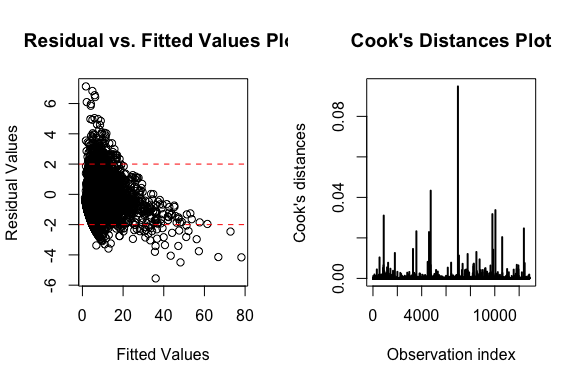

# Preprocessing
- mean-imputed on charges and added charges.na
- Drop `Patient` ID column because of irrelevance
- Drop `DIED` column because of perfect colinearity with `DRG` (`DRG` == 123 when `DIED` == 1) 

```r
ami <- readRDS("../../data/amidata_clean.rds") %>%
  dplyr::select(-one_of(c("patient", "died")))# drop patient ID column

# ami[ami$los == 0, ]
table(ami$los)[1:15]
```

```
## 
##    0    1    2    3    4    5    6    7    8    9   10   11   12   13   14 
##    1 1194  732  750  826  980 1303 1418 1262 1040  742  581  407  330  254
```

# Model on mean-imputed data

```r
step_noint <- step(glm.nb(los ~ .,  data=ami), trace=0, direction='both')
step_noint
```

```
## 
## Call:  glm.nb(formula = los ~ diagnosis + sex + drg + charges + age + 
##     charges.na, data = ami, init.theta = 14.58072939, link = log)
## 
## Coefficients:
##    (Intercept)  diagnosis41011  diagnosis41021  diagnosis41031  
##      8.821e-01      -7.332e-03      -7.973e-03      -6.750e-02  
## diagnosis41041  diagnosis41051  diagnosis41071  diagnosis41081  
##     -1.325e-02       6.799e-02      -1.300e-02      -5.895e-02  
## diagnosis41091            sexM          drg122          drg123  
##      3.756e-02      -4.548e-02      -5.740e-02      -6.529e-01  
##        charges             age      charges.na  
##      5.853e-05       8.578e-03       1.372e-01  
## 
## Degrees of Freedom: 12843 Total (i.e. Null);  12829 Residual
## Null Deviance:	    27080 
## Residual Deviance: 12830 	AIC: 64820
```

We then fit the negative binomial model with the variables picked by the stepwise regression
(diagnosis + sex + drg + charges + age + charges.na)


```r
mod_nb_noint <- glm.nb(formula(step_noint), data = ami)
summary(mod_nb_noint)
```

```
## 
## Call:
## glm.nb(formula = formula(step_noint), data = ami, init.theta = 14.58072939, 
##     link = log)
## 
## Deviance Residuals: 
##     Min       1Q   Median       3Q      Max  
## -4.4896  -0.7817  -0.0746   0.5047   6.8684  
## 
## Coefficients:
##                  Estimate Std. Error z value Pr(>|z|)    
## (Intercept)     8.821e-01  3.349e-02  26.337  < 2e-16 ***
## diagnosis41011 -7.332e-03  2.378e-02  -0.308   0.7578    
## diagnosis41021 -7.973e-03  3.602e-02  -0.221   0.8248    
## diagnosis41031 -6.750e-02  3.549e-02  -1.902   0.0572 .  
## diagnosis41041 -1.325e-02  2.308e-02  -0.574   0.5658    
## diagnosis41051  6.799e-02  4.293e-02   1.584   0.1132    
## diagnosis41071 -1.300e-02  2.401e-02  -0.541   0.5884    
## diagnosis41081 -5.895e-02  3.513e-02  -1.678   0.0933 .  
## diagnosis41091  3.756e-02  2.218e-02   1.693   0.0904 .  
## sexM           -4.548e-02  8.634e-03  -5.267 1.38e-07 ***
## drg122         -5.740e-02  8.876e-03  -6.467 9.97e-11 ***
## drg123         -6.529e-01  1.622e-02 -40.253  < 2e-16 ***
## charges         5.853e-05  5.578e-07 104.943  < 2e-16 ***
## age             8.578e-03  3.324e-04  25.807  < 2e-16 ***
## charges.na      1.372e-01  1.726e-02   7.948 1.89e-15 ***
## ---
## Signif. codes:  0 '***' 0.001 '**' 0.01 '*' 0.05 '.' 0.1 ' ' 1
## 
## (Dispersion parameter for Negative Binomial(14.5807) family taken to be 1)
## 
##     Null deviance: 27076  on 12843  degrees of freedom
## Residual deviance: 12832  on 12829  degrees of freedom
## AIC: 64823
## 
## Number of Fisher Scoring iterations: 1
## 
## 
##               Theta:  14.581 
##           Std. Err.:  0.507 
## 
##  2 x log-likelihood:  -64790.749
```
Because both `charges` and `charges.na` are significant predictors in the model, we proceeded with the data with mean-imputed missing values.

The ratio of residual deviance to residual degrees of freedom (12832/12829) indicates a good fit of the model to the data.


```r
step_withint <- step(glm.nb(los ~ .^2.,  data=ami), trace=0, direction='both')
step_withint
```

```
## 
## Call:  glm.nb(formula = los ~ diagnosis + sex + drg + charges + age + 
##     charges.na + diagnosis:sex + diagnosis:drg + diagnosis:charges + 
##     diagnosis:age + diagnosis:charges.na + sex:drg + sex:charges + 
##     sex:age + sex:charges.na + drg:charges + drg:age + drg:charges.na + 
##     charges:age + age:charges.na, data = ami, init.theta = 15.97313774, 
##     link = log)
## 
## Coefficients:
##               (Intercept)             diagnosis41011  
##                 7.000e-01                  1.051e-01  
##            diagnosis41021             diagnosis41031  
##                 1.331e-02                 -1.113e-01  
##            diagnosis41041             diagnosis41051  
##                -2.944e-02                 -1.884e-01  
##            diagnosis41071             diagnosis41081  
##                -7.234e-02                 -6.249e-02  
##            diagnosis41091                       sexM  
##                 5.149e-02                  1.599e-01  
##                    drg122                     drg123  
##                -1.018e-01                 -8.650e-01  
##                   charges                        age  
##                 6.069e-05                  1.193e-02  
##                charges.na        diagnosis41011:sexM  
##                 2.782e-01                 -5.642e-02  
##       diagnosis41021:sexM        diagnosis41031:sexM  
##                -1.089e-01                  5.983e-02  
##       diagnosis41041:sexM        diagnosis41051:sexM  
##                -3.049e-02                 -7.964e-02  
##       diagnosis41071:sexM        diagnosis41081:sexM  
##                -2.119e-02                 -1.165e-01  
##       diagnosis41091:sexM      diagnosis41011:drg122  
##                -4.484e-02                 -6.369e-02  
##     diagnosis41021:drg122      diagnosis41031:drg122  
##                 4.998e-02                  8.443e-02  
##     diagnosis41041:drg122      diagnosis41051:drg122  
##                 2.504e-02                  8.025e-02  
##     diagnosis41071:drg122      diagnosis41081:drg122  
##                -1.116e-02                 -5.708e-02  
##     diagnosis41091:drg122      diagnosis41011:drg123  
##                 1.855e-02                 -1.398e-01  
##     diagnosis41021:drg123      diagnosis41031:drg123  
##                -2.678e-01                 -1.451e-01  
##     diagnosis41041:drg123      diagnosis41051:drg123  
##                 2.292e-02                  2.595e-01  
##     diagnosis41071:drg123      diagnosis41081:drg123  
##                -2.993e-02                  5.448e-02  
##     diagnosis41091:drg123     diagnosis41011:charges  
##                -2.527e-02                 -7.233e-06  
##    diagnosis41021:charges     diagnosis41031:charges  
##                -5.133e-06                  9.221e-06  
##    diagnosis41041:charges     diagnosis41051:charges  
##                -4.631e-07                  2.871e-06  
##    diagnosis41071:charges     diagnosis41081:charges  
##                -1.474e-06                  5.286e-06  
##    diagnosis41091:charges         diagnosis41011:age  
##                -3.499e-07                  9.618e-04  
##        diagnosis41021:age         diagnosis41031:age  
##                 1.453e-03                 -2.156e-03  
##        diagnosis41041:age         diagnosis41051:age  
##                 7.271e-04                  3.133e-03  
##        diagnosis41071:age         diagnosis41081:age  
##                 1.663e-03                  6.077e-04  
##        diagnosis41091:age  diagnosis41011:charges.na  
##                 4.181e-04                 -6.215e-02  
## diagnosis41021:charges.na  diagnosis41031:charges.na  
##                 1.472e-02                  3.013e-02  
## diagnosis41041:charges.na  diagnosis41051:charges.na  
##                -1.886e-01                  2.584e-02  
## diagnosis41071:charges.na  diagnosis41081:charges.na  
##                -1.350e-01                 -3.597e-02  
## diagnosis41091:charges.na                sexM:drg122  
##                -1.402e-01                  1.174e-03  
##               sexM:drg123               sexM:charges  
##                 3.058e-02                  1.241e-06  
##                  sexM:age            sexM:charges.na  
##                -2.617e-03                 -8.745e-02  
##            drg122:charges             drg123:charges  
##                 1.372e-05                  2.877e-05  
##                drg122:age                 drg123:age  
##                -1.678e-03                 -1.581e-03  
##         drg122:charges.na          drg123:charges.na  
##                -1.314e-01                 -7.553e-02  
##               charges:age             age:charges.na  
##                -1.421e-07                  1.174e-03  
## 
## Degrees of Freedom: 12843 Total (i.e. Null);  12768 Residual
## Null Deviance:	    27860 
## Residual Deviance: 12730 	AIC: 64480
```

We then fit the negative binomial model with the variables picked by the stepwise regression
(diagnosis + sex + drg + charges + age + charges.na + diagnosis:sex + diagnosis:drg + diagnosis:charges + diagnosis:age + diagnosis:charges.na + sex:drg + sex:charges + sex:age + sex:charges.na + drg:charges + drg:age + drg:charges.na + charges:age + age:charges.na)


```r
mod_nb_withint <- glm.nb(formula(step_withint), data = ami)
summary(mod_nb_withint)
```

```
## 
## Call:
## glm.nb(formula = formula(step_withint), data = ami, init.theta = 15.97299142, 
##     link = log)
## 
## Deviance Residuals: 
##     Min       1Q   Median       3Q      Max  
## -5.5529  -0.7635  -0.0853   0.5033   7.1325  
## 
## Coefficients:
##                             Estimate Std. Error z value Pr(>|z|)    
## (Intercept)                7.000e-01  1.487e-01   4.708 2.50e-06 ***
## diagnosis41011             1.051e-01  1.505e-01   0.698 0.484922    
## diagnosis41021             1.331e-02  2.300e-01   0.058 0.953879    
## diagnosis41031            -1.113e-01  2.374e-01  -0.469 0.639275    
## diagnosis41041            -2.944e-02  1.470e-01  -0.200 0.841264    
## diagnosis41051            -1.884e-01  2.653e-01  -0.710 0.477511    
## diagnosis41071            -7.234e-02  1.548e-01  -0.467 0.640194    
## diagnosis41081            -6.249e-02  2.275e-01  -0.275 0.783522    
## diagnosis41091             5.149e-02  1.410e-01   0.365 0.714950    
## sexM                       1.599e-01  6.833e-02   2.341 0.019251 *  
## drg122                    -1.018e-01  7.089e-02  -1.436 0.151035    
## drg123                    -8.650e-01  1.333e-01  -6.490 8.59e-11 ***
## charges                    6.069e-05  4.184e-06  14.506  < 2e-16 ***
## age                        1.193e-02  1.833e-03   6.506 7.74e-11 ***
## charges.na                 2.782e-01  1.355e-01   2.054 0.039979 *  
## diagnosis41011:sexM       -5.642e-02  5.094e-02  -1.108 0.267983    
## diagnosis41021:sexM       -1.089e-01  7.853e-02  -1.386 0.165628    
## diagnosis41031:sexM        5.983e-02  7.822e-02   0.765 0.444399    
## diagnosis41041:sexM       -3.049e-02  4.956e-02  -0.615 0.538450    
## diagnosis41051:sexM       -7.964e-02  8.958e-02  -0.889 0.373996    
## diagnosis41071:sexM       -2.119e-02  5.110e-02  -0.415 0.678393    
## diagnosis41081:sexM       -1.165e-01  7.375e-02  -1.580 0.114064    
## diagnosis41091:sexM       -4.484e-02  4.757e-02  -0.943 0.345877    
## diagnosis41011:drg122     -6.369e-02  5.301e-02  -1.202 0.229553    
## diagnosis41021:drg122      4.998e-02  8.020e-02   0.623 0.533107    
## diagnosis41031:drg122      8.443e-02  7.755e-02   1.089 0.276289    
## diagnosis41041:drg122      2.504e-02  5.130e-02   0.488 0.625449    
## diagnosis41051:drg122      8.025e-02  9.390e-02   0.855 0.392769    
## diagnosis41071:drg122     -1.116e-02  5.350e-02  -0.209 0.834729    
## diagnosis41081:drg122     -5.708e-02  7.880e-02  -0.724 0.468868    
## diagnosis41091:drg122      1.855e-02  4.961e-02   0.374 0.708564    
## diagnosis41011:drg123     -1.398e-01  7.900e-02  -1.770 0.076693 .  
## diagnosis41021:drg123     -2.678e-01  1.308e-01  -2.048 0.040561 *  
## diagnosis41031:drg123     -1.451e-01  1.428e-01  -1.016 0.309663    
## diagnosis41041:drg123      2.292e-02  8.058e-02   0.284 0.776079    
## diagnosis41051:drg123      2.595e-01  1.396e-01   1.859 0.063003 .  
## diagnosis41071:drg123     -2.993e-02  8.889e-02  -0.337 0.736385    
## diagnosis41081:drg123      5.449e-02  1.162e-01   0.469 0.639158    
## diagnosis41091:drg123     -2.527e-02  7.308e-02  -0.346 0.729525    
## diagnosis41011:charges    -7.233e-06  2.963e-06  -2.441 0.014643 *  
## diagnosis41021:charges    -5.133e-06  4.749e-06  -1.081 0.279791    
## diagnosis41031:charges     9.221e-06  5.407e-06   1.705 0.088132 .  
## diagnosis41041:charges    -4.630e-07  2.954e-06  -0.157 0.875464    
## diagnosis41051:charges     2.871e-06  6.983e-06   0.411 0.680936    
## diagnosis41071:charges    -1.474e-06  3.006e-06  -0.490 0.623864    
## diagnosis41081:charges     5.286e-06  4.473e-06   1.182 0.237272    
## diagnosis41091:charges    -3.498e-07  2.805e-06  -0.125 0.900751    
## diagnosis41011:age         9.618e-04  1.818e-03   0.529 0.596741    
## diagnosis41021:age         1.453e-03  2.967e-03   0.490 0.624374    
## diagnosis41031:age        -2.156e-03  3.063e-03  -0.704 0.481459    
## diagnosis41041:age         7.271e-04  1.781e-03   0.408 0.683020    
## diagnosis41051:age         3.133e-03  3.338e-03   0.938 0.348053    
## diagnosis41071:age         1.663e-03  1.866e-03   0.891 0.372663    
## diagnosis41081:age         6.077e-04  2.773e-03   0.219 0.826543    
## diagnosis41091:age         4.181e-04  1.697e-03   0.246 0.805355    
## diagnosis41011:charges.na -6.215e-02  9.526e-02  -0.652 0.514114    
## diagnosis41021:charges.na  1.472e-02  1.366e-01   0.108 0.914182    
## diagnosis41031:charges.na  3.013e-02  1.577e-01   0.191 0.848462    
## diagnosis41041:charges.na -1.886e-01  9.228e-02  -2.044 0.040951 *  
## diagnosis41051:charges.na  2.584e-02  2.048e-01   0.126 0.899626    
## diagnosis41071:charges.na -1.350e-01  9.615e-02  -1.405 0.160153    
## diagnosis41081:charges.na -3.597e-02  1.439e-01  -0.250 0.802567    
## diagnosis41091:charges.na -1.402e-01  8.667e-02  -1.617 0.105775    
## sexM:drg122                1.174e-03  1.855e-02   0.063 0.949549    
## sexM:drg123                3.058e-02  3.343e-02   0.915 0.360417    
## sexM:charges               1.241e-06  1.128e-06   1.100 0.271386    
## sexM:age                  -2.617e-03  6.839e-04  -3.827 0.000130 ***
## sexM:charges.na           -8.745e-02  3.670e-02  -2.383 0.017173 *  
## drg122:charges             1.372e-05  1.300e-06  10.550  < 2e-16 ***
## drg123:charges             2.877e-05  1.607e-06  17.896  < 2e-16 ***
## drg122:age                -1.678e-03  6.935e-04  -2.420 0.015519 *  
## drg123:age                -1.581e-03  1.469e-03  -1.076 0.281815    
## drg122:charges.na         -1.314e-01  3.692e-02  -3.560 0.000371 ***
## drg123:charges.na         -7.553e-02  6.861e-02  -1.101 0.270953    
## charges:age               -1.421e-07  4.510e-08  -3.150 0.001631 ** 
## age:charges.na             1.174e-03  1.430e-03   0.821 0.411813    
## ---
## Signif. codes:  0 '***' 0.001 '**' 0.01 '*' 0.05 '.' 0.1 ' ' 1
## 
## (Dispersion parameter for Negative Binomial(15.973) family taken to be 1)
## 
##     Null deviance: 27864  on 12843  degrees of freedom
## Residual deviance: 12733  on 12768  degrees of freedom
## AIC: 64484
## 
## Number of Fisher Scoring iterations: 1
## 
## 
##               Theta:  15.973 
##           Std. Err.:  0.587 
## 
##  2 x log-likelihood:  -64330.349
```

Note that `charges` and `charges.na` are both significant in this model. 

The ratio of residual deviance to residual degrees of freedom (12733/12768) indicates a good fit of the model to the data.

# Likelihood ratio test of the two models

```r
anova(mod_nb_noint, mod_nb_withint)
```

```
## Likelihood ratio tests of Negative Binomial Models
## 
## Response: los
##                                                                                                                                                                                                                                                                      Model
## 1                                                                                                                                                                                                                       diagnosis + sex + drg + charges + age + charges.na
## 2 diagnosis + sex + drg + charges + age + charges.na + diagnosis:sex + diagnosis:drg + diagnosis:charges + diagnosis:age + diagnosis:charges.na + sex:drg + sex:charges + sex:age + sex:charges.na + drg:charges + drg:age + drg:charges.na + charges:age + age:charges.na
##      theta Resid. df    2 x log-lik.   Test    df LR stat. Pr(Chi)
## 1 14.58073     12829       -64790.75                              
## 2 15.97299     12768       -64330.35 1 vs 2    61 460.4002       0
```

From the above likelihood ratio test, we can see that the model with interaction terms is significantly different than the model without interaction terms. Therefore, we proceed with the model with interaction terms

# Model Diagnosis
## Residual plot and Cook's Distance

```r
par(mfrow=c(1,2))
# Residuals plot
plot(residuals(mod_nb_withint)~fitted(mod_nb_withint),
     xlab="Fitted Values",
     ylab="Residual Values", 
     main="Residual vs. Fitted Values Plot")
abline(h = -2, lty = 2, col = 'red')
abline(h = 2, lty = 2, col = 'red')

plot(cooks.distance(mod_nb_withint), type="h", lwd=2,
  xlab="Observation index",
  ylab="Cook's distances",
  main="Cook's Distances Plot")
abline(h=1,lty=2,col="red")
```

<!-- -->

## Colinearity


```r
car::vif(mod_nb_withint)
```

```
##                              GVIF Df GVIF^(1/(2*Df))
## diagnosis            1.211960e+13  8        6.572310
## sex                  7.106534e+01  1        8.430026
## drg                  5.113630e+03  2        8.456338
## charges              6.207271e+01  1        7.878624
## age                  3.783284e+01  1        6.150840
## charges.na           6.352454e+01  1        7.970229
## diagnosis:sex        3.339720e+04  8        1.917485
## diagnosis:drg        6.599320e+05 16        1.520055
## diagnosis:charges    4.057777e+05  8        2.241393
## diagnosis:age        2.256537e+12  8        5.916844
## diagnosis:charges.na 4.233218e+01  8        1.263767
## sex:drg              9.211513e+00  2        1.742139
## sex:charges          4.900561e+00  1        2.213721
## sex:age              3.203892e+01  1        5.660293
## sex:charges.na       2.705860e+00  1        1.644950
## drg:charges          1.241441e+01  2        1.877075
## drg:age              1.544093e+03  2        6.268569
## drg:charges.na       2.394028e+00  2        1.243891
## charges:age          3.981960e+01  1        6.310277
## age:charges.na       3.406203e+01  1        5.836268
```

There are a number of terms with a GVIF^(1/(2*Df)) greater than $\sqrt{10}$ (3.16), though we suspect this is due to the presence of interaction terms. We therefore fit the baseline model without interaction terms and redid the VIF inspection.


```r
model_noint_baseline = glm.nb(formula = los ~ diagnosis + sex + drg + charges + age + charges.na , data = ami)
car::vif(model_noint_baseline)
```

```
##                GVIF Df GVIF^(1/(2*Df))
## diagnosis  1.040222  8        1.002468
## sex        1.099949  1        1.048784
## drg        1.159781  2        1.037753
## charges    1.063696  1        1.031356
## age        1.202102  1        1.096404
## charges.na 1.004701  1        1.002348
```

These values are all much less than $\sqrt{10}$, suggesting there is no multicollinearity in the base predictors, and the multicollinearity present in the full model comes from the interaction terms.
