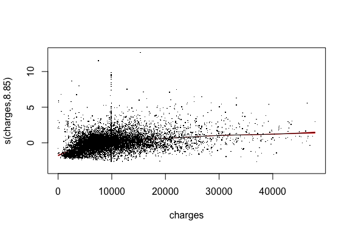

## Poisson Regression Model

The reponse variable, Length of Stay (LOS), has a minimum value of 0 and a maximum value of 38. Our first idea is to investigate the poisson model; we did not invetigate the zero-flated model because the current dataset only had 1 observation with a 0 length of stay. It makes sense to model LOS as a Poisson count process because we can treat individual patient as the "confined space," and count how many days (0 or larger) the patient stayed in the hospital since admittance. To select the best-performing model, we used stepwise selection. 


```r
#stepwise model selection for poisson regression model
best_model <- stats::step(glm(los ~ ., family = 'poisson', data = ami_train), trace=0, direction='both')
summary(best_model)
```

```
## 
## Call:
## glm(formula = los ~ diagnosis + sex + drg + charges + age + charges.na, 
##     family = "poisson", data = ami_train)
## 
## Deviance Residuals: 
##     Min       1Q   Median       3Q      Max  
## -5.5029  -0.9302  -0.0931   0.6278   9.1286  
## 
## Coefficients:
##                  Estimate Std. Error z value Pr(>|z|)    
## (Intercept)     9.577e-01  2.966e-02  32.289  < 2e-16 ***
## diagnosis41011  1.211e-03  2.090e-02   0.058   0.9538    
## diagnosis41021  3.720e-02  3.192e-02   1.165   0.2439    
## diagnosis41031 -6.616e-02  3.200e-02  -2.068   0.0387 *  
## diagnosis41041 -9.268e-03  2.032e-02  -0.456   0.6482    
## diagnosis41051  5.437e-02  3.914e-02   1.389   0.1648    
## diagnosis41071 -3.205e-04  2.108e-02  -0.015   0.9879    
## diagnosis41081 -4.941e-02  3.112e-02  -1.588   0.1123    
## diagnosis41091  4.205e-02  1.949e-02   2.157   0.0310 *  
## sexM           -4.900e-02  7.619e-03  -6.432 1.26e-10 ***
## drg122         -6.550e-02  7.931e-03  -8.259  < 2e-16 ***
## drg123         -6.089e-01  1.502e-02 -40.555  < 2e-16 ***
## charges         5.212e-05  4.323e-07 120.551  < 2e-16 ***
## age             8.461e-03  2.986e-04  28.335  < 2e-16 ***
## charges.na      1.273e-01  1.528e-02   8.336  < 2e-16 ***
## ---
## Signif. codes:  0 '***' 0.001 '**' 0.01 '*' 0.05 '.' 0.1 ' ' 1
## 
## (Dispersion parameter for poisson family taken to be 1)
## 
##     Null deviance: 32671  on 10278  degrees of freedom
## Residual deviance: 15704  on 10264  degrees of freedom
## AIC: 53226
## 
## Number of Fisher Scoring iterations: 5
```

The result above suggested that the full model best predicts the length of stay. The summary suggests that there is potentially a lack of fit by the model as the dispersion parameter approximates $\frac{15704}{10264} \approx 1.53$, rather than $\phi = 1$, which is assumed by the Poisson regression model. The diagnostic plots below do not suggest any significant influential observations. However, the residual vs. fitted plot suggests our model lack fit because the residuals display a fan-like pattern with values beyond the acceptable -2 and 2 bound.


```r
par(mfrow=c(1,1))
#rvf
plot(residuals(best_model)~fitted(best_model),
     xlab="Fitted Values",
     ylab="Residual Values", 
     main="RVF Plot for the Poisson Model")
abline(h=-2,lty=2,col="red")
abline(h=2,lty=2,col="red")
```

<!-- -->

```r
#plot cook's distance
plot(cooks.distance(best_model), type="h", lwd=2,
  xlab="Observation index",
  ylab="Cook's distances",
  main="Cook's distances for the Poisson Model")
abline(h=1,lty=2,col="red")
```

<!-- -->

The grouped variance inflation factors do not suggest any issue with multicollinearity. The root mean squared error on test set prediction is 3.73.


```r
#check vif
car::vif(best_model)
```

```
##                GVIF Df GVIF^(1/(2*Df))
## diagnosis  1.042892  8        1.002628
## sex        1.104438  1        1.050923
## drg        1.172799  2        1.040653
## charges    1.089192  1        1.043644
## age        1.210215  1        1.100098
## charges.na 1.009587  1        1.004782
```


```r
#check test performance of best model selected above
best_model_pred <- predict(best_model, ami_test, type = 'response')
rmse_vec(ami_test$los, best_model_pred)
```

```
## [1] 3.726119
```


## Adding Interaction Terms

In this section we explore the effect of introducing interaction terms to our model. The motivation behind this is that some of our predictor variables could be interacting with each other to affect patients' length of stay. Because our model includes primarily categorical predictors, we only explored 2-way interactions. 


```r
# With interaction terms
best_int <- stats::step(glm(los ~ .^2, family = 'poisson', data = ami_train), trace=0, direction='both')
summary(best_int)
```

```
## 
## Call:
## glm(formula = los ~ diagnosis + sex + drg + charges + age + charges.na + 
##     diagnosis:drg + diagnosis:charges + sex:charges + sex:age + 
##     sex:charges.na + drg:charges + drg:age + drg:charges.na + 
##     charges:age, family = "poisson", data = ami_train)
## 
## Deviance Residuals: 
##     Min       1Q   Median       3Q      Max  
## -7.0876  -0.9086  -0.1132   0.6140   8.8779  
## 
## Coefficients:
##                          Estimate Std. Error z value Pr(>|z|)    
## (Intercept)             6.413e-01  6.925e-02   9.260  < 2e-16 ***
## diagnosis41011          1.607e-01  4.716e-02   3.408 0.000655 ***
## diagnosis41021          1.100e-01  7.440e-02   1.479 0.139261    
## diagnosis41031         -2.239e-01  8.153e-02  -2.746 0.006031 ** 
## diagnosis41041         -1.530e-02  4.644e-02  -0.330 0.741757    
## diagnosis41051         -5.249e-02  9.028e-02  -0.581 0.560959    
## diagnosis41071          5.994e-02  4.721e-02   1.270 0.204236    
## diagnosis41081         -6.201e-02  7.261e-02  -0.854 0.393037    
## diagnosis41091          8.010e-02  4.408e-02   1.817 0.069218 .  
## sexM                    8.553e-02  4.338e-02   1.972 0.048629 *  
## drg122                 -2.700e-02  5.837e-02  -0.463 0.643682    
## drg123                 -6.488e-01  1.194e-01  -5.435 5.49e-08 ***
## charges                 6.240e-05  3.437e-06  18.159  < 2e-16 ***
## age                     1.364e-02  7.506e-04  18.169  < 2e-16 ***
## charges.na              1.986e-01  2.627e-02   7.562 3.95e-14 ***
## diagnosis41011:drg122  -1.046e-01  4.576e-02  -2.285 0.022298 *  
## diagnosis41021:drg122   1.555e-02  6.906e-02   0.225 0.821807    
## diagnosis41031:drg122   8.123e-02  6.979e-02   1.164 0.244425    
## diagnosis41041:drg122   3.608e-03  4.417e-02   0.082 0.934891    
## diagnosis41051:drg122   4.397e-02  8.401e-02   0.523 0.600717    
## diagnosis41071:drg122  -3.566e-02  4.594e-02  -0.776 0.437655    
## diagnosis41081:drg122  -5.318e-02  6.876e-02  -0.773 0.439277    
## diagnosis41091:drg122  -7.373e-03  4.265e-02  -0.173 0.862744    
## diagnosis41011:drg123  -2.369e-01  7.372e-02  -3.214 0.001309 ** 
## diagnosis41021:drg123  -2.719e-01  1.161e-01  -2.343 0.019128 *  
## diagnosis41031:drg123  -2.828e-01  1.278e-01  -2.213 0.026910 *  
## diagnosis41041:drg123  -3.417e-02  7.514e-02  -0.455 0.649227    
## diagnosis41051:drg123   7.245e-02  1.298e-01   0.558 0.576652    
## diagnosis41071:drg123  -1.119e-01  8.135e-02  -1.375 0.169075    
## diagnosis41081:drg123   9.159e-02  1.035e-01   0.885 0.376133    
## diagnosis41091:drg123  -8.636e-02  6.774e-02  -1.275 0.202331    
## diagnosis41011:charges -7.112e-06  2.348e-06  -3.029 0.002452 ** 
## diagnosis41021:charges -5.663e-06  4.067e-06  -1.392 0.163809    
## diagnosis41031:charges  1.118e-05  4.627e-06   2.417 0.015637 *  
## diagnosis41041:charges  1.080e-06  2.338e-06   0.462 0.644022    
## diagnosis41051:charges  6.927e-06  5.547e-06   1.249 0.211757    
## diagnosis41071:charges -2.580e-06  2.346e-06  -1.099 0.271584    
## diagnosis41081:charges  2.383e-06  3.563e-06   0.669 0.503568    
## diagnosis41091:charges -1.929e-06  2.206e-06  -0.875 0.381834    
## sexM:charges            1.565e-06  8.816e-07   1.776 0.075802 .  
## sexM:age               -2.232e-03  5.957e-04  -3.747 0.000179 ***
## sexM:charges.na        -4.889e-02  3.123e-02  -1.566 0.117393    
## drg122:charges          1.088e-05  1.057e-06  10.292  < 2e-16 ***
## drg123:charges          2.661e-05  1.329e-06  20.017  < 2e-16 ***
## drg122:age             -2.176e-03  6.061e-04  -3.590 0.000331 ***
## drg123:age             -3.115e-03  1.364e-03  -2.284 0.022367 *  
## drg122:charges.na      -1.203e-01  3.230e-02  -3.726 0.000195 ***
## drg123:charges.na      -6.261e-02  6.467e-02  -0.968 0.332937    
## charges:age            -2.140e-07  3.738e-08  -5.724 1.04e-08 ***
## ---
## Signif. codes:  0 '***' 0.001 '**' 0.01 '*' 0.05 '.' 0.1 ' ' 1
## 
## (Dispersion parameter for poisson family taken to be 1)
## 
##     Null deviance: 32671  on 10278  degrees of freedom
## Residual deviance: 15088  on 10230  degrees of freedom
## AIC: 52678
## 
## Number of Fisher Scoring iterations: 5
```

The best model with interaction suggested by the stepwise selection process includes all interactions, except those between sex and drug, and sex and diagnosis. However, the dispersion factor approximation also appears to be off the chart as $\hat{\phi} \approx \frac{15088}{10230} \approx 1.47$. The diagnostic below renders the same conclusions as above. RMSE on test set is slightly higher than that rendered by the model without interaction terms.


```r
par(mfrow=c(1,1))
#rvf
plot(residuals(best_int)~fitted(best_int),
     xlab="Fitted Values",
     ylab="Residual Values", 
     main="RVF Plot for the Poisson Model with Interactions")
abline(h=-2,lty=2,col="red")
abline(h=2,lty=2,col="red")
```

<!-- -->

```r
#plot cook's distance
plot(cooks.distance(best_int), type="h", lwd=2,
  xlab="Observation index",
  ylab="Cook's distances",
  main="Cook's distances for the Poisson Model with Interactions")
abline(h=1,lty=2,col="red")
```

<!-- -->


```r
#check test performance of best interaction model selected above
best_int_pred <- predict(best_int, ami_test, type = 'response')
rmse_vec(ami_test$los, best_int_pred)
```

```
## [1] 3.907624
```

The analysis of deviance test below suggests that the interaction terms do introduce significant information to the model. However, given the diagnostic plots and RMSE results above, we should keep investigating other model.


```r
#compare model with and without interactions
anova(best_model, best_int, test = 'Chi')
```

```
## Analysis of Deviance Table
## 
## Model 1: los ~ diagnosis + sex + drg + charges + age + charges.na
## Model 2: los ~ diagnosis + sex + drg + charges + age + charges.na + diagnosis:drg + 
##     diagnosis:charges + sex:charges + sex:age + sex:charges.na + 
##     drg:charges + drg:age + drg:charges.na + charges:age
##   Resid. Df Resid. Dev Df Deviance  Pr(>Chi)    
## 1     10264      15704                          
## 2     10230      15088 34   616.49 < 2.2e-16 ***
## ---
## Signif. codes:  0 '***' 0.001 '**' 0.01 '*' 0.05 '.' 0.1 ' ' 1
```


## Generative Additive Model


```r
head(ami_train)
```

```
##   diagnosis sex drg charges los age charges.na
## 2     41041   F 122    3941   6  34          0
## 5     41091   M 122    1681   1  55          0
## 6     41091   M 121    6379   9  84          0
## 7     41091   F 121   10959  15  84          0
## 8     41091   F 121   16584  15  70          0
## 9     41041   M 121    4015   2  76          0
```


```r
gam_full <- gam(los ~ s(charges) + s(age) + diagnosis + sex + drg + charges.na, family = 'poisson', data = ami_train)
summary(gam_full)
```

```
## 
## Family: poisson 
## Link function: log 
## 
## Formula:
## los ~ s(charges) + s(age) + diagnosis + sex + drg + charges.na
## 
## Parametric coefficients:
##                 Estimate Std. Error z value Pr(>|z|)    
## (Intercept)     1.970930   0.019802  99.530  < 2e-16 ***
## diagnosis41011  0.001782   0.020936   0.085   0.9322    
## diagnosis41021  0.016344   0.031951   0.512   0.6090    
## diagnosis41031 -0.078363   0.032037  -2.446   0.0144 *  
## diagnosis41041 -0.016956   0.020345  -0.833   0.4046    
## diagnosis41051  0.028685   0.039181   0.732   0.4641    
## diagnosis41071  0.023394   0.021122   1.108   0.2680    
## diagnosis41081 -0.044809   0.031155  -1.438   0.1504    
## diagnosis41091  0.044144   0.019530   2.260   0.0238 *  
## sexM           -0.051363   0.007658  -6.707 1.98e-11 ***
## drg122         -0.046041   0.007912  -5.819 5.91e-09 ***
## drg123         -0.462680   0.015248 -30.344  < 2e-16 ***
## charges.na      0.001595   0.016569   0.096   0.9233    
## ---
## Signif. codes:  0 '***' 0.001 '**' 0.01 '*' 0.05 '.' 0.1 ' ' 1
## 
## Approximate significance of smooth terms:
##              edf Ref.df  Chi.sq p-value    
## s(charges) 8.845  8.992 13787.2  <2e-16 ***
## s(age)     8.470  8.887   853.5  <2e-16 ***
## ---
## Signif. codes:  0 '***' 0.001 '**' 0.01 '*' 0.05 '.' 0.1 ' ' 1
## 
## R-sq.(adj) =  0.576   Deviance explained = 60.1%
## UBRE = 0.27328  Scale est. = 1         n = 10279
```

The summary of the GAM model above suggests non-linear relationships between age, charges and our response variable. Comparing the full gam model with the glm model without interaction terms selected above, we see that at least one of the predictors, charges/age, contributes significantly and non-linearly in predicting partients' length of stay in the hospital. 


```r
#compare gam and glm
anova(best_model, gam_full, test = 'Chi')
```

```
## Analysis of Deviance Table
## 
## Model 1: los ~ diagnosis + sex + drg + charges + age + charges.na
## Model 2: los ~ s(charges) + s(age) + diagnosis + sex + drg + charges.na
##   Resid. Df Resid. Dev     Df Deviance  Pr(>Chi)    
## 1     10264      15704                              
## 2     10249      13027 15.316   2676.9 < 2.2e-16 ***
## ---
## Signif. codes:  0 '***' 0.001 '**' 0.01 '*' 0.05 '.' 0.1 ' ' 1
```


```r
plot(gam_full, residuals = TRUE, shade=TRUE, shade.col = 2)
```

<!-- --><!-- -->


```r
#check test performance of gam
gam_pred <- predict(gam_full, ami_test, type = 'response')
rmse_vec(ami_test$los, gam_pred)
```

```
## [1] 3.364594
```


```r
par(mfrow=c(1,1))
#rvf
plot(residuals(gam_full)~fitted(gam_full),
     xlab="Fitted Values",
     ylab="Residual Values", 
     main="RVF Plot for the GAM Poisson Model")
abline(h=-2,lty=2,col="red")
abline(h=2,lty=2,col="red")
```

<!-- -->

```r
#plot cook's distance
plot(cooks.distance(gam_full), type="h", lwd=2,
  xlab="Observation index",
  ylab="Cook's distances",
  main="Cook's distances for the GAM Poisson Model")
abline(h=1,lty=2,col="red")
```

<!-- -->
